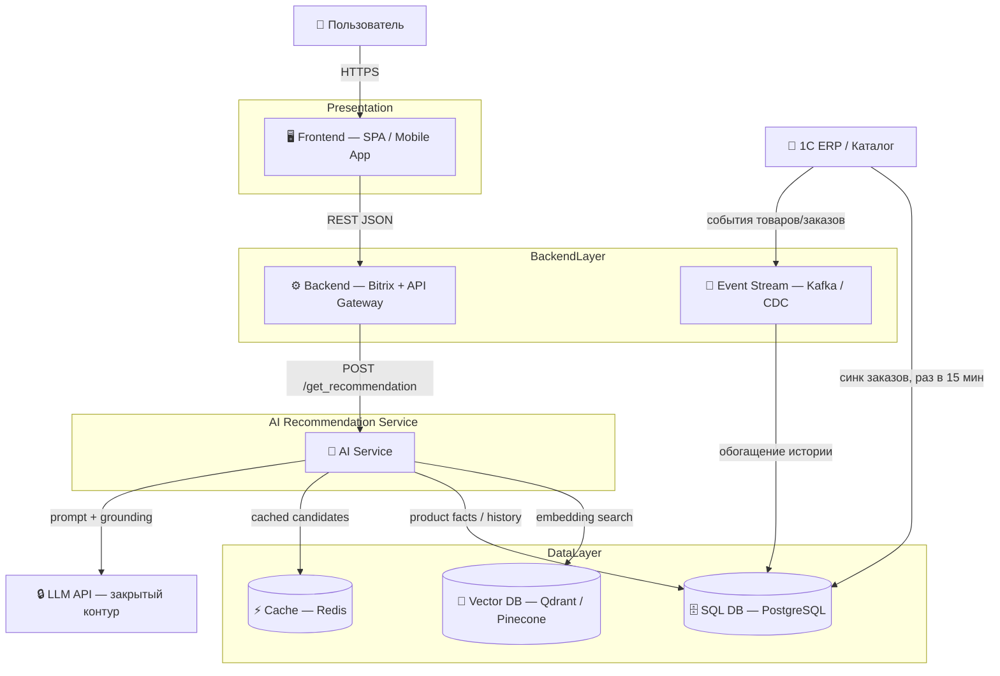
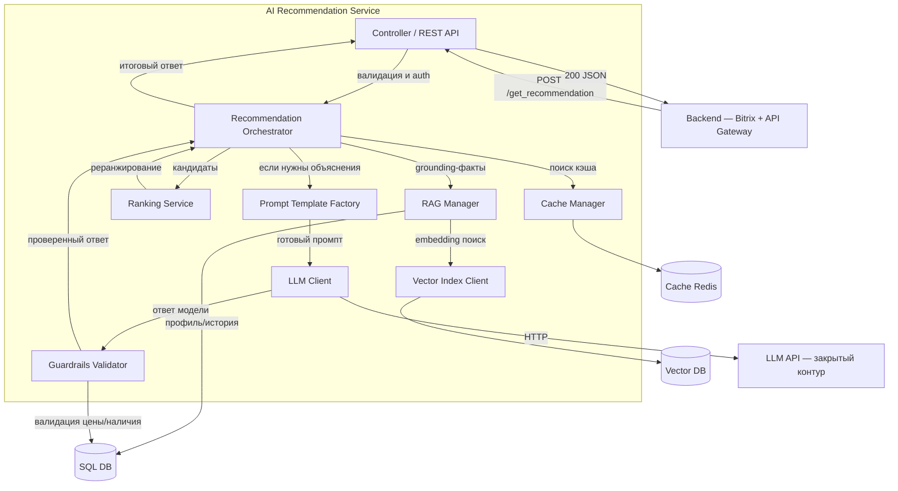
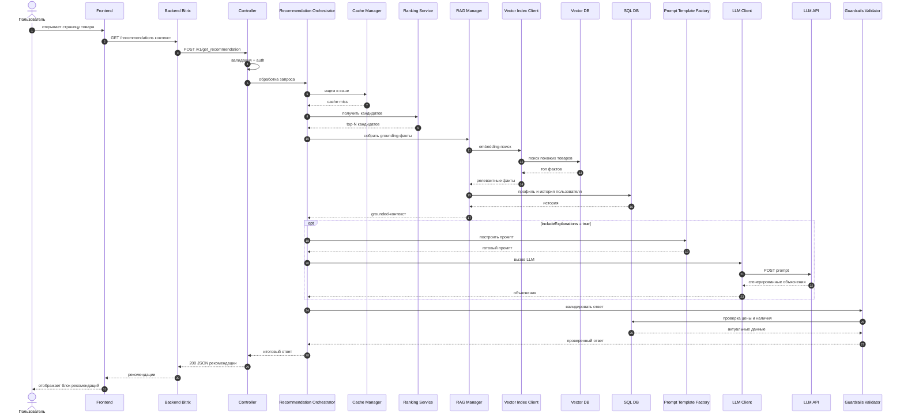

# Многоуровневое проектирование AI-сервиса TechnoMart: C4 Model + OpenAPI

_Кейс: «TechnoMart» — интеллектуальная система персонализированных рекомендаций для ритейлера._

Продолжение работы из ДЗ-1 (стратегия внедрения, риски, roadmap). Проектируем многоуровневую архитектуру AI-сервиса:

1. **C2 Container Diagram** — контейнеры всей системы.
2. **C3 Component Diagram** — внутренние компоненты контейнера AI Service.
3. **Sequence Diagram** — сценарий «Пользователь запрашивает рекомендацию».
4. **OpenAPI-спецификация** `POST /get_recommendation` для согласования интеграции между Backend и AI Service.

Все диаграммы реализованы в **Mermaid** (код). Спецификация API — в **OpenAPI 3.0 (YAML)**.

---


## 1. C2 Container Diagram

Контейнеры системы в нотации C4. Выделены обязательные контейнеры: **Frontend, Backend, AI Service, Vector DB, SQL DB**, плюс внешние системы (LLM в закрытом контуре и 1C ERP), обоснованные стратегией из ДЗ-1.



**Пояснения по связям:**
- `Backend` выступает единственной точкой входа для `Frontend` и единственным клиентом `AI Service` — интеграция согласуется через OpenAPI (пункт 4).
- `AI Service` не ходит напрямую к пользователю и не пишет в `SQL DB` напрямую для каталога — только читает факты/историю, что защищает монолит (риск №5 из ДЗ-1).
- `LLM API` вынесен как внешняя система в **закрытом контуре** (compliance по ПДн, риск №4 из ДЗ-1).

---

## 2. C3 Component Diagram — внутренности AI Service

«Проваливаемся» внутрь контейнера AI Service. Добавлены компоненты, обеспечивающие SLA 200 мс и guardrails (обоснованы рисками ДЗ-1).



**Роли компонентов:**
- **Controller** — принимает `POST /get_recommendation`, аутентификация (API-key), валидация, маппинг ответа.
- **Recommendation Orchestrator** — оркестрирует сценарий: cache → candidates → re-rank → grounding → (опц.) LLM → guardrails.
- **RAG Manager** — собирает факты из Vector DB и SQL DB для grounding, чтобы снизить галлюцинации.
- **Vector Index Client** — клиент embedding-поиска к Vector DB.
- **Ranking Service** — realtime re-ranking кандидатов (гибрид: collaborative filtering + rule-based, холодный старт из ДЗ-1).
- **Prompt Template Factory** — готовит промпты из шаблонов с подстановкой grounded-фактов (исключает свободную генерацию).
- **LLM Client** — клиент к закрытому LLM-контуру (аномизация ПДн до промпта).
- **Guardrails Validator** — валидатор вывода: цена/наличие соответствуют каталогу, отсекает несуществующие характеристики.
- **Cache Manager** — кэширует популярные рекомендации для SLA.

---

## 3. Sequence Diagram — «Пользователь запрашивает рекомендацию»

Сценарий согласован с C3-компонентами и эндпоинтом `POST /get_recommendation`. Показан как happy-path с опциональным LLM-объяснением.



**Связность C3 ↔ Sequence:** компоненты на C3 (Controller, Recommendation Orchestrator, Cache Manager, Ranking Service, RAG Manager, Vector Index Client, Prompt Template Factory, LLM Client, Guardrails Validator) полностью совпадают с участниками на Sequence Diagram, а поток соответствует телу `POST /get_recommendation`.

---

## 4. OpenAPI-спецификация API `POST /get_recommendation`

Взаимодействие между **Backend** и **AI Service**. Формат — OpenAPI 3.0 (YAML). Включены типы данных, примеры запросов/ответов и коды ошибок (400/401/404/429/500/503).

```yaml
openapi: 3.0.3
info:
  title: TechnoMart AI Recommendation Service API
  version: 1.0.0
  description: |
    Синхронный REST API для получения персонализированных рекомендаций.
    Используется Backend (Bitrix) для формирования блока рекомендаций.
    Поддержано RAG-grounding и опциональные генеративные объяснения.
servers:
  - url: https://ai-api.technomart.internal/v1
    description: Закрытый внутренний контур AI Service
security:
  - ApiKeyAuth: []
tags:
  - name: Recommendations
    description: Персонализированные рекомендации

paths:
  /get_recommendation:
    post:
      tags:
        - Recommendations
      operationId: getRecommendation
      summary: Получить персональные рекомендации
      description: |
        Возвращает ранжированный список товаров-рекомендаций.
        Горячий путь использует precomputed кандидатов и realtime re-ranking
        для соблюдения SLA p95 < 200 мс. Генеративные объяснения включаются
        флагом includeExplanations и проходят guardrails-валидацию.
      parameters:
        - name: X-Request-Id
          in: header
          required: false
          schema:
            type: string
            format: uuid
          description: Сквозной идентификатор запроса для трассировки
      requestBody:
        required: true
        content:
          application/json:
            schema:
              $ref: '#/components/schemas/RecommendationRequest'
            example:
              userId: "u_1002345"
              sessionId: "sess_9f3a1c"
              context:
                page: product
                productId: "sku_778812"
                categoryId: "cat_electronics"
                channel: web
              limit: 10
              includeExplanations: true
      responses:
        '200':
          description: Список рекомендаций успешно сформирован
          content:
            application/json:
              schema:
                $ref: '#/components/schemas/RecommendationResponse'
              example:
                requestId: "req_4b7d9012"
                userId: "u_1002345"
                items:
                  - productId: "sku_449001"
                    rank: 1
                    score: 0.94
                    reason: "Похоже на текущий товар"
                    explanation: "Подойдёт, если нужна модель с 5G и поддержкой eSIM."
                  - productId: "sku_512034"
                    rank: 2
                    score: 0.89
                    reason: "Часто покупают вместе"
                    explanation: "Совместимый чехол и защитное стекло в комплекте."
                modelVersion: "rec-v2.3.1"
                generatedAt: "2026-08-09T19:40:00Z"
                latencyMs: 142
        '400':
          $ref: '#/components/responses/BadRequest'
        '401':
          $ref: '#/components/responses/Unauthorized'
        '404':
          $ref: '#/components/responses/NotFound'
        '429':
          $ref: '#/components/responses/TooManyRequests'
        '500':
          $ref: '#/components/responses/InternalError'
        '503':
          $ref: '#/components/responses/ServiceUnavailable'

components:
  securitySchemes:
    ApiKeyAuth:
      type: apiKey
      in: header
      name: X-API-Key

  schemas:
    RecommendationRequest:
      type: object
      additionalProperties: false
      required:
        - context
      properties:
        userId:
          type: string
          nullable: true
          description: Идентификатор авторизованного пользователя. null для анонимных.
          example: "u_1002345"
        sessionId:
          type: string
          description: Идентификатор сессии для анонимной персонализации.
          example: "sess_9f3a1c"
        context:
          $ref: '#/components/schemas/RequestContext'
        limit:
          type: integer
          minimum: 1
          maximum: 50
          default: 10
          description: Максимальное число рекомендаций.
        includeExplanations:
          type: boolean
          default: false
          description: Включить генеративные объяснения (LLM + guardrails). Увеличивает latency.

    RequestContext:
      type: object
      additionalProperties: false
      required:
        - page
      properties:
        page:
          type: string
          enum: [home, product, cart, search, checkout]
          description: Тип страницы, на которой запрашиваются рекомендации.
        productId:
          type: string
          nullable: true
          description: Текущий товар (для page = product).
        categoryId:
          type: string
          nullable: true
          description: Категория для контекстной рекомендации.
        channel:
          type: string
          enum: [web, mobile, push, email]
          default: web
          description: Канал показа рекомендаций.

    RecommendationResponse:
      type: object
      additionalProperties: false
      required:
        - requestId
        - items
      properties:
        requestId:
          type: string
          description: Идентификатор запроса (для трассировки и логирования).
          example: "req_4b7d9012"
        userId:
          type: string
          nullable: true
          description: Вернувшийся идентификатор пользователя, если передан.
        items:
          type: array
          minItems: 0
          maxItems: 50
          items:
            $ref: '#/components/schemas/RecommendationItem'
        modelVersion:
          type: string
          description: Версия модели рекомендаций.
          example: "rec-v2.3.1"
        generatedAt:
          type: string
          format: date-time
        latencyMs:
          type: integer
          description: Время обработки на стороне AI Service, мс.

    RecommendationItem:
      type: object
      additionalProperties: false
      required:
        - productId
        - rank
        - score
      properties:
        productId:
          type: string
          example: "sku_449001"
        rank:
          type: integer
          minimum: 1
          description: Порядковый номер в списке.
        score:
          type: number
          format: float
          minimum: 0
          maximum: 1
          description: Уверенность модели в рекомендации.
        reason:
          type: string
          nullable: true
          enum: [similar_to_current, bought_together, top_in_category, cold_start_popular, based_on_history]
          description: Машинный код причины рекомендации.
        explanation:
          type: string
          nullable: true
          description: Генеративное объяснение на естественном языке (если includeExplanations).
          example: "Подойдёт, если нужна модель с 5G и поддержкой eSIM."

    ApiError:
      type: object
      additionalProperties: false
      required:
        - code
        - message
      properties:
        code:
          type: string
          example: "VALIDATION_ERROR"
        message:
          type: string
          description: Человекочитаемое описание ошибки.
        requestId:
          type: string
          nullable: true
          description: Сквозной идентификатор запроса.

  responses:
    BadRequest:
      description: Некорректный запрос или невалидный JSON
      content:
        application/json:
          schema:
            $ref: '#/components/schemas/ApiError'
          example:
            code: VALIDATION_ERROR
            message: "Поле context.page должно быть одним из: home, product, cart, search, checkout"
            requestId: "req_4b7d9012"
    Unauthorized:
      description: Отсутствует или невалидный API-key
      content:
        application/json:
          schema:
            $ref: '#/components/schemas/ApiError'
          example:
            code: UNAUTHORIZED
            message: "Невалидный или отсутствующий X-API-Key"
            requestId: "req_4b7d9012"
    NotFound:
      description: Ресурс не найден (например, productId отсутствует в каталоге)
      content:
        application/json:
          schema:
            $ref: '#/components/schemas/ApiError'
          example:
            code: PRODUCT_NOT_FOUND
            message: "Товар sku_778812 не найден в каталоге"
            requestId: "req_4b7d9012"
    TooManyRequests:
      description: Превышен лимит запросов (rate limit)
      content:
        application/json:
          schema:
            $ref: '#/components/schemas/ApiError'
          example:
            code: RATE_LIMITED
            message: "Превышен лимит запросов, повторите позже"
            requestId: "req_4b7d9012"
    InternalError:
      description: Внутренняя ошибка AI Service
      content:
        application/json:
          schema:
            $ref: '#/components/schemas/ApiError'
          example:
            code: INTERNAL_ERROR
            message: "Внутренняя ошибка сервиса"
            requestId: "req_4b7d9012"
    ServiceUnavailable:
      description: Внешняя зависимость недоступна (Vector DB / LLM)
      content:
        application/json:
          schema:
            $ref: '#/components/schemas/ApiError'
          example:
            code: UPSTREAM_UNAVAILABLE
            message: "Источник данных рекомендаций временно недоступен"
            requestId: "req_4b7d9012"
```

---

