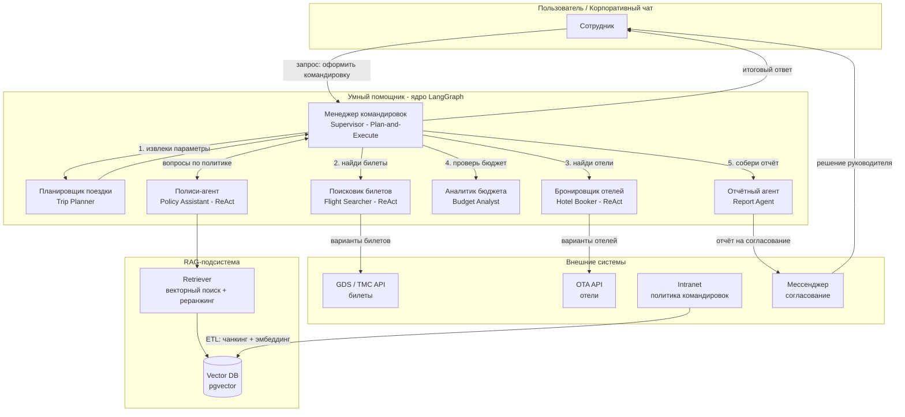
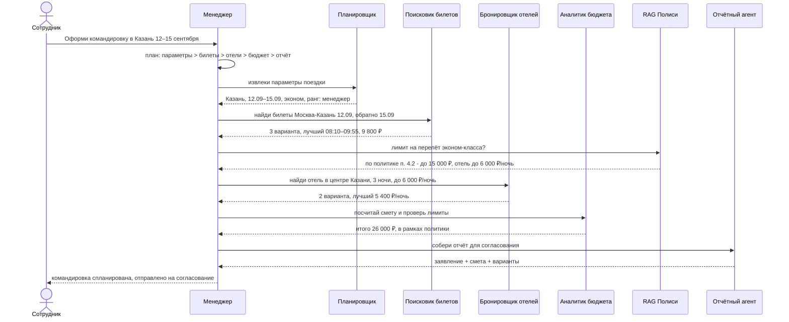
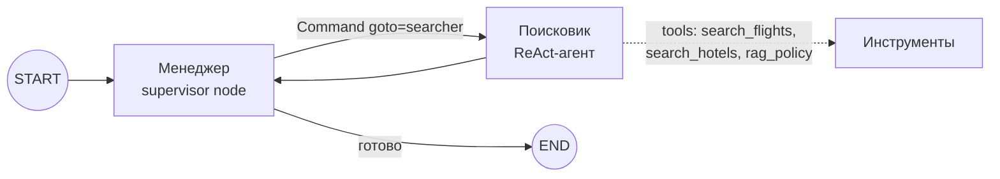

# ДЗ-03. Архитектура мультиагентной системы «Умный помощник командировок»

## Документ 1. Design: агенты, паттерны, схема взаимодействия

---

## 1. Контекст и бизнес-процесс

**Процесс «Организация командировки» (as-is):** сотрудник вручную ищет билеты и отели,
читает политику командировок (PDF на intranet), согласовывает бюджет с руководителем,
заполняет заявление, передаёт данные в бухгалтерию. Процесс долгий, с ошибками
(превышение лимитов, нарушение политики бронирования).

**To-be:** сотрудник пишет запрос в чат «Умного помощника» > система сама планирует
маршрут, подбирает билеты/отели в рамках политики компании, проверяет бюджет,
готовит отчёт для согласования.

### Границы системы

- **Внутри:** планирование, поиск и сравнение вариантов, проверка политики через RAG, расчёт бюджета, формирование отчёта.
- **Снаружи:** согласование руководителем (уведомление в корпоративный мессенджер), фактическое бронирование в TMC/API-провайдеров, оплата (бухгалтерская система).

---

## 2. Выбор паттерна мультиагентной системы

**Паттерн: иерархия (Supervisor + Workers) с элементами конвейера.**

Обоснование:

1. Процесс командировки - последовательность зависимых шагов: сначала даты/маршрут, затем поиск, затем проверка политики, затем бюджет. Чистый «круглый стол» равноправных агентов избыточен.
2. Нужна единая точка принятия решений и остановки - Менеджер (supervisor), как в примере с лекции.
3. Поиск билетов/отелей/политики - независимые подзадачи, которые можно делегировать параллельно воркерам (элемент конвейера/сотрудничества).
4. Single Responsibility: каждый агент умеет делать одну вещь и делает её хорошо.

**Агентные циклы:**

- Менеджер - **Plan-and-Execute**: строит план командировки, делегирует шаги, контролирует результат, завершает сценарий.
- Воркеры - **ReAct**: рассуждают > вызывают инструмент (API поиска, RAG-ретрив) > наблюдают результат > отвечают.

---

## 3. Роли агентов (Single Responsibility)

| Агент                                  | Зона ответственности - ровно одна | Инструменты | Не делает |
|----------------------------------------|-----------------------------------|-------------|-----------|
| **Менеджер командировок** - Supervisor | Диалог с пользователем, декомпозиция запроса в план, делегирование, агрегация результатов, решение о завершении | - | Не ищет билеты сам, не считает лимиты сам |
| **Планировщик поездки** - Trip Planner | Извлечение структурировных параметров: город, даты, предпочтения, ранг сотрудника | `extract_trip_params` | Не ищет варианты |
| **Поисковик билетов** - Flight Searcher | Поиск и сравнение авиа/жд вариантов по параметрам | `search_flights` | Не бронирует, не проверяет политику |
| **Бронировщик отелей** - Hotel Booker  | Поиск и сравнение отелей | `search_hotels` | Не проверяет бюджет |
| **Аналитик бюджета** - Budget Analyst  | Расчёт сметы, сравнение с лимитами по политике, вердикт «в рамках / превышение» | `calculate_budget`, `check_policy_limit` | Не ищет варианты |
| **Полиси-агент** - Policy Assistant    | Ответы на вопросы по политике командировок на основе RAG | `rag_search_policy` | Не принимает решений, только цитирует политику |
| **Отчётный агент** - Report Agent      | Формирование итогового отчёта/заявления на командировку | `render_report` | Не добавляет новую информацию |

> В прототипе (`trip_assistant.py`) показано ядро паттерна: **Менеджер > Поисковик** (+ мини-RAG), как требует задание.

---

## 4. Схема взаимодействия агентов

### 4.1. Общая схема системы

### 4.2. Диаграмма последовательности - сценарий «Организация командировки»

### 4.3. Граф LangGraph прототипа (Менеджер > Поисковик)

**Механика обмена сообщениями:**

- Общий state: `messages` + `next` (следующий агент).
- Менеджер возвращает `Command(goto="searcher", update={...})` - это и есть делегирование.
- Поисковик (ReAct) вызывает инструменты, результат дописывает в `messages`.
- Менеджер видит ответ Поисковика в state и формирует финальный ответ > `END`.

---

## 5. Как используется RAG (данные о политике командировок)

**Проблема:** политика командировок - внутренний документ (PDF/DOCX на intranet, десятки страниц, периодически обновляется). Класть её в промпт нельзя: не влезает в контекст, быстро устаревает, нет контроля версий.

**Решение - RAG-подсистема:**

1. **Ingestion (offline):** документы политики > ETL > чанкинг > эмбеддинг > загрузка в Vector DB (см. документ `02_rag_flow.md`).
2. **Retrieval (online):** Полиси-агент и Аналитик бюджета через инструмент `rag_search_policy` получают релевантные фрагменты политики (топ-k после реранжинга).
3. **Grounding:** ответы агентов всегда опираются на цитаты политики - снижаются галлюцинации при проверке лимитов.
4. **Обновление:** при выходе новой редакции политики пере-индексация идёт через ETL, агенты не меняются.

**Кто обращается к RAG:**

| Потребитель | Когда | Зачем |
|-------------|-------|-------|
| Менеджер | при планировании | класс авиабукинга, правила предзакупки |
| Полиси-агент | по запросу участников | точные лимиты, исключения, суточные |
| Аналитик бюджета | при проверке сметы | лимиты по рангу сотрудника и городу |

---

## 6. Нефункциональные требования (кратко)

| Аспект | Решение |
|--------|---------|
| Наблюдаемость | LangSmith / трейсинг LangGraph: каждый шаг агента логируется |
| Безопасность | Политика в закрытом контуре, доступ к Vector DB по сервисной учётке, PII не покидает периметр |
| Отказоустойчивость | Таймауты и ретраи LLM-вызовов (`request_timeout`, `max_retries`), `recursion_limit` на граф |
| Стоимость | YandexGPT Lite для воркеров, Pro только для Менеджера и отчёта |
| Идемпотентность | План командировки сохраняется в state/checkpoint, сессию можно продолжить |
