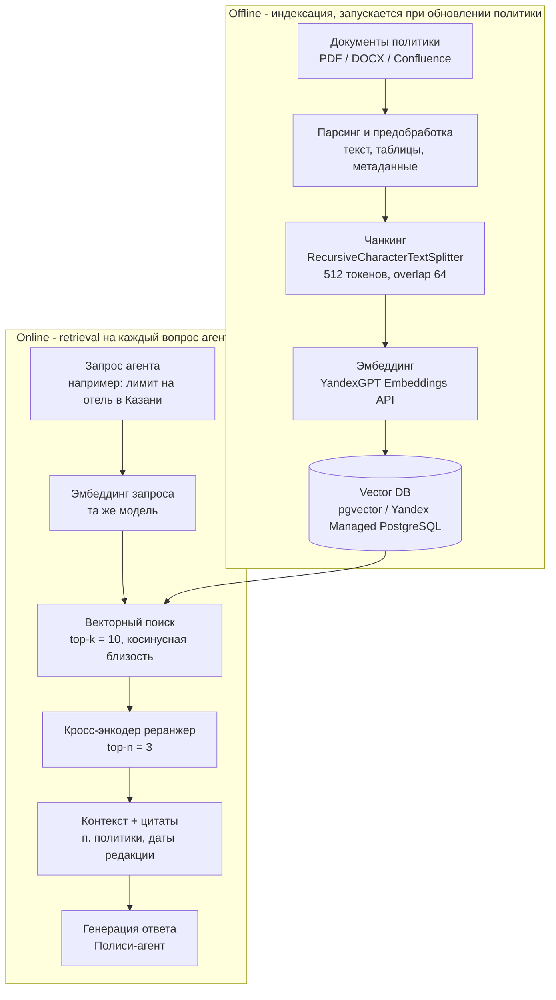

# ДЗ-03. RAG-пайплайн подсистемы «Умный помощник командировок»

## Документ 2. RAG Flow: чанкинг, эмбеддинг, Vector DB, реранжинг

---

## 1. Назначение

RAG отвечает на вопросы вида «какой лимит на отель в Казани для менеджера?», «за сколько
дней до вылета надо бронировать билет эконом-класса?», опираясь на **актуальную редакцию
политики командировок компании**. Документы: «Политика командировок» (PDF, ~40 стр.),
«Памятка по суточным», регламенты TMC, FAQ бухгалтерии.

**Почему RAG, а не промпт:** документ длинный, часто обновляется, содержит таблицы лимитов
по городам и рангам - в промпт не положить, а дообучать модель на каждую редакцию дорого и медленно.

---

## 2. Общая схема пайплайна

---

## 3. Offline-этап: индексация

### 3.1. Парсинг и предобработка

- **Источник истины:** Confluence-страница «Политика командировок» + PDF для истории.
- Извлечение текста: `PyMuPDF` для PDF, Confluence API для вики.
- Таблицы лимитов (город × ранг × лимит) преобразуются в текстовые строки вида
  `«Казань | менеджер | отель ≤ 6 000 ₽/ночь | перелёт эконом ≤ 15 000 ₽»` - так таблицы
  не разрушаются при чанкинге.
- **Метаданные каждого фрагмента:** номер раздела, дата редакции документа, тип
  (лимит / правило / исключение), ранги и города, к которым применим пункт.

### 3.2. Чанкинг

| Параметр | Значение | Обоснование |
|----------|----------|-------------|
| Стратегия | Recursive splitting по разделителям `\n\n` > `\n` > `. ` | Сохраняет целостность пунктов политики |
| Размер чанка | ~512 токенов | Пункт политики укладывается целиком; баланс точности поиска и контекста |
| Overlap | 64 токена | Сшивка граничных случаев, когда правило разбито между чанками |
| Особый случай | Таблица лимитов - одна строка = один чанк | Строка таблицы самодостаточна и точна для поиска |

### 3.3. Эмбеддинг

- Модель: **эмбеддинги YandexGPT** (или `text-search`-серия) - тот же вендор, что и LLM,
  работает в закрытом контуре компании.
- Размерность: 256/1024 (зависит от выбранной модели, фиксируется в схеме Vector DB).
- Эмбеддинг считается для чанка и для поискового запроса - обязательно одной моделью.

### 3.4. Vector DB

- **Выбор: Yandex Managed Service for PostgreSQL + расширение `pgvector`** (HNSW-индекс).
- Обоснование: управляемый сервис в контуре компании, поддержка прав доступа, транзакции,
  метаданные в тех же таблицах, не нужен отдельный специализированный сервис.
- Схема хранения: `chunks(id, doc_id, section, text, embedding vector(1024), metadata jsonb, updated_at)`.
- HNSW-индекс: `m=16, ef_construction=64`, метрика - косинусная близость.
- Версионирование: поле `doc_revision`; при пере-индексации новая редакция пишется рядом,
  затем атомарно переключается `active_revision` - агенты всегда видят согласованную версию.

---

## 4. Online-этап: retrieval

1. **Формирование запроса.** Полиси-агент переписывает вопрос в поисковый запрос
   (query rewriting): «лимит на отель в Казани для менеджера» > добавляет фильтры по метаданным
   (`city = Казань`, `rank = менеджер`, `type = лимит`).
2. **Гибридный поиск.** Векторный поиск (top-10) + BM25 по ключевым словам («Казань», «отель»,
   «лимит») > слияние результатов (reciprocal rank fusion). Точные термины политики
   (номера приказов, «суточные») лучше ловит лексический поиск.
3. **Фильтрация по метаданным** на стороне БД (SQL WHERE) - сразу отсекает неприменимые ранги/города.

### 4.1. Реранжинг

- **Кросс-энкодер-реранжер** (например, bge-reranker / Yandex Reranker API) оценивает пару
  «запрос × чанк» совместно - точнее, чем би-энкодер на первом шаге.
- Из top-10 после реранжинга остаются **top-3** чанка - этого достаточно для ответа и не
  раздувает контекст LLM.
- Порог релевантности: чанки со скором ниже порога отбрасываются; если пусто - агент честно
  отвечает «в политике не найдено, эскалирую на travel-менеджера» вместо галлюцинации.

### 4.2. Генерация

- Промпт Полиси-агента: «Отвечай ТОЛЬКО на основе фрагментов ниже, цитируй номер пункта
  и дату редакции. Если ответа нет во фрагментах - так и скажи».
- В ответ агент возвращает: текст + цитаты (пункт политики) - Менеджер и Аналитик бюджета
  используют эти цитаты как обоснование вердикта по смете.

---

## 5. Контроль качества RAG

| Метрика | Что измеряет | Целевое значение |
|---------|--------------|------------------|
| Recall@5 | Доля вопросов, где релевантный чанк попал в топ-5 | ≥ 0.9 |
| MRR | Средняя позиция релевантного чанка | ≥ 0.8 |
| Faithfulness (RAGAS) | Ответ обоснован цитатами, без домыслов | ≥ 0.95 |
| Энд-ту-энд тест | Набор из ~50 вопросов с эталонными ответами по политике | прогон при каждой пере-индексации |

Тестовый набор вопросов ведётся вместе с документом: при изменении политики travel-менеджер
обновляет эталоны - пере-индексация автоматически валидируется.

---

## 6. Мини-RAG в прототипе (скрипт `trip_assistant.py`)

В прототипе пайплайн упрощён, но сохраняет все стадии:

| Стадия | Production | Прототип в скрипте |
|--------|-----------|---------------------|
| Документы | PDF/Confluence | 8–10 фрагментов политики в списке Python |
| Чанкинг | Recursive splitter 512/64 | `RecursiveCharacterTextSplitter` на коротком корпусе |
| Эмбеддинг | YandexGPT Embeddings API | детерминированный hash-эмбеддинг (без внешних вызовов) |
| Vector DB | pgvector + HNSW | `InMemoryVectorStore` из LangChain |
| Ретрив | гибридный + фильтры | косинусный top-k |
| Реранжинг | кросс-энкодер | скор по перекрытию терминов (простая эвристика) |
| Генерация | YandexGPT | YandexGPT (реальный вызов) |

Инструмент `rag_search_policy` доступен агенту-Поисковику как обычный tool - паттерн
«RAG как инструмент агента» идентичен production-варианту.
