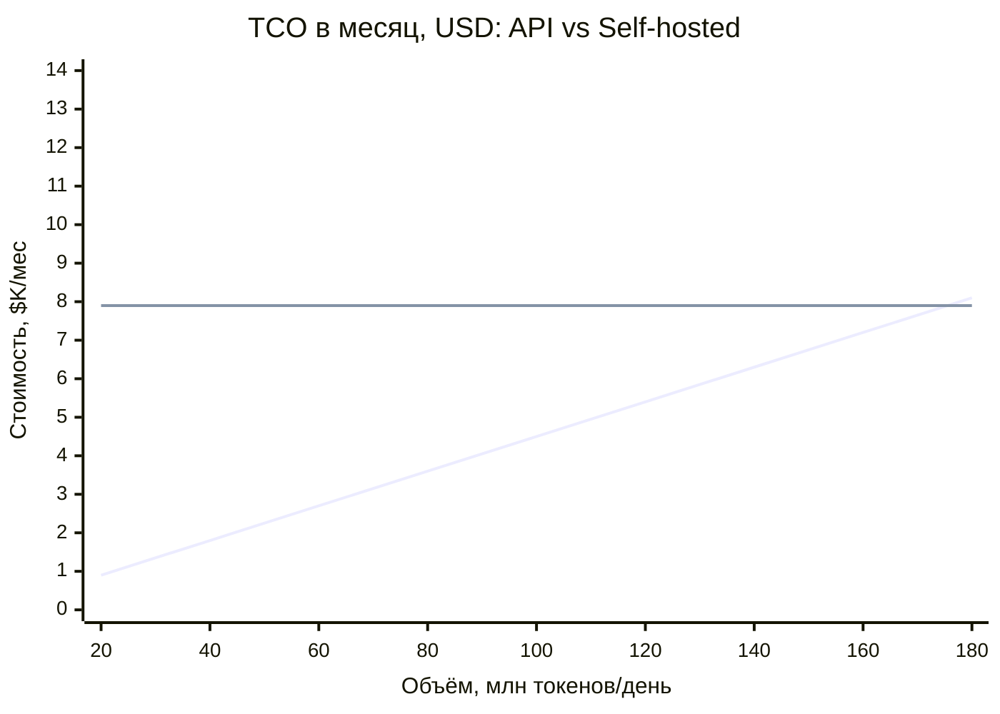

# ДЗ-04. Анализ дилеммы хостинга LLM: SaaS vs Self-hosted

## Сравнительный анализ по критериям

**Проект:** «Умный помощник командировок» (Trip Assistant)

**Дилемма:** использовать проприетарную облачную модель (SaaS API, класс GPT-5 / YandexGPT Pro) или развернуть Open-Source модель (Llama 3 70B) на собственных серверах (Self-hosted).

---

## 1. Контекст проекта и ограничения

Из архитектуры ДЗ-03 (мультиагентная система на LangGraph: Supervisor + 6 воркеров, RAG по политике командировок на pgvector):

| Фактор | Значение для дилеммы |
|--------|----------------------|
| Стадия продукта | MVP → Production, трафик ещё не подтверждён |
| Нагрузка на LLM | ~1 000 диалогов/день на старте (прогноз), ~30–50 LLM-вызовов на диалог (агентный цикл + RAG) |
| Данные в промптах | PII сотрудников (имя, ранг, маршрут, даты, бюджеты) + внутренняя политика командировок |
| Ключевые сценарии LLM | Tool calling (поиск билетов/отелей), структурированный вывод (JSON-смета), RAG-ответы с цитатами |
| Команда | 2–3 ML-инженера, нет выделенной инфраструктурной команды GPU |
| Бюджет | Операционные расходы предпочтительнее капитальных (CAPEX на GPU-парк не согласован) |

---

## 2. Сравнение по критериям

### 2.1. Стоимость

**SaaS (GPT-5-класс по API):**
- Оплата за токены: флагманские модели ~\$2.5–10 / 1M input токенов, ~\$10–40 / 1M output; лёгкие модели для воркеров — на порядок дешевле (от \$0.12/1M у open-source моделей на инференс-провайдерах).
- Оценка для MVP: ~1 000 диалогов/день × 40 вызовов × ~2K токенов ≈ 80M токенов/день суммарно; при смешанной стратегии (флагман только для Supervisor/отчёта, лёгкая модель для воркеров) — \$1.5–4K/мес.
- Нет CAPEX, нет обязательств; масштабируется линейно с ростом.

**Self-hosted (Llama 3 70B):**
- Минимальная конфигурация для 70B в FP8/INT4: 2× A100 80GB или 1× H100 (для HA — ×2). Аренда: A100 80GB ~\$3.2/hr, H100 ~\$6.75/hr (AWS on-demand; пре-коммит/спот дешевле).
- Даже одна нода H100 24/7 ≈ \$4.9K/мес только за GPU, плюс MLOps-инженер (~\$8–15K/мес ФОТ, частичная занятость), плюс нагрузка на существующую платформенную команду.
- По данным индустриальных разборов (a16z, «Navigating the High Cost of AI Compute»): self-hosted окупается только при высокой утилизации GPU; при утилизации < 30–40% (типично для MVP) TCO self-hosted в 3–10 раз выше API. Кейс: 1M токенов на Llama 3.3 70B = \$0.12 у API-провайдера против \$43 при self-hosting на Lambda Labs при низкой загрузке.

**Вывод по критерию:** SaaS дешевле на этапе MVP при непредсказуемом трафике; self-hosted становится выгодным только при стабильной высокой утилизации (порог безубыточности — см. §3).

### 2.2. Безопасность данных (Privacy)

**SaaS:**
- Риск: PII и внутренние документы покидают периметр компании.
- Митигируется контрактом и архитектурой: DPA + Zero Data Retention (OpenAI предлагает ZDR для frontier-моделей: промпты не сохраняются после обработки; Azure OpenAI — GDPR-контур, данные не используются для обучения), обезличивание PII до промпта (маскирование имён/паспортов), RAG-контур остаётся внутри периметра — наружу уходят только релевантные фрагменты политики.
- Остаточный риск: юрисдикция провайдера, изменение условий обслуживания, subpoena в стране провайдера.

**Self-hosted:**
- Максимальный контроль: данные физически не покидают контур; полный аудит-лог; лёгкая сертификация под внутренние security-требования (ФЗ-152, изоляция контура).
- Остаточный риск: безопасность теперь наша зона ответственности (патчи vLLM/Triton, утечки через логи инференса, физический доступ).

**Вывод по критерию:** Self-hosted формально сильнее по приватности, но для данного кейса (PII сотрудников, не клиентские данные под PCI/HIPAA) риск SaaS закрывается до приемлемого уровня связкой DPA + ZDR + PII-маскирование. Критерий не является блокером.

### 2.3. Качество ответов

**SaaS (GPT-5-класс):**
- Флагманские модели стабильно лидируют в агентных задачах: tool calling, многошаговое планирование, структурированный вывод, следование системным инструкциям. На агентных бенчмарках разрыв с open-source ощутим: например, GPT-4o 55% vs Llama 3.3 70B 44% (Vellum, агентные сценарии); для GPT-5-класса разрыв больше.
- Для мультиагентной системы качество Supervisor'а критично: ошибка планирования каскадно портит весь диалог.

**Self-hosted (Llama 3 70B):**
- Сильная модель для своего класса (близка к GPT-4-turbo на простых Q&A), но уступает флагманам в сложном tool calling и длинных агентных цепочках; чаще ошибки в JSON-схемах, требуется больше few-shot примеров и ретраев.
- Русский язык: Llama 3 70B приемлем, но уступает специализированным (YandexGPT/Qwen); для русскоязычного ассистента это дополнительный минус.

**Вывод по критерию:** SaaS выигрывает; для агентного паттерна (ДЗ-03) это важнейший функциональный критерий.

### 2.4. Latency

**SaaS:**
- TTFT (time-to-first-token) 300–800 мс у флагманов, генерация 50–100+ tok/s; деградация в пики у провайдера вне нашего контроля; сетевой RTT до регионального endpoint 20–60 мс.
- Для чат-сценария ассистента (пользователь ждёт ответа) — комфортно; стриминг сглаживает восприятие.

**Self-hosted:**
- На выделенном GPU: TTFT 100–300 мс, A100 ~130 tok/s на 70B (batch 1), H100 выше; предсказуемо и без «соседей».
- Но: при всплесках нужна очередь/автоскейл, иначе — таймауты; холодный старт новых реплик инференса — минуты.

**Вывод по критерию:** Паритет с преимуществом self-hosted на пиках (при правильном сайзинге) и преимуществом SaaS в отсутствии необходимости этим управлять. Для чат-UX оба варианта проходят SLA p95 < 3с на ответ.

### 2.5. Сложность поддержки

**SaaS:**
- Провайдер отвечает за доступность, апгрейды, безопасность модели. Наша зона: промпты, оркестрация, лимиты затрат.
- Риски: deprecation моделей (миграция раз в 6–12 мес), изменение цен, rate limits, вендор lock-in.

**Self-hosted:**
- Полный стек нашей ответственности: драйверы, vLLM/TGI, квантизация, роутинг, канареечные выкатки весов, мониторинг GPU (DCGM), on-call. Требует выделенной компетенции (MLOps/Platform), которой в команде нет.
- Плюс: полный контроль версий модели (никаких принудительных апгрейдов).

**Вывод по критерию:** SaaS радикально проще; self-hosted требует найма/выделения MLOps-инженера — организационный риск для команды из 2–3 человек.

---

## 3. Расчёт порога безубыточности

**Затраты self-hosted (фикс):** Llama 3 70B на 1× H100 (аренда \$6.75/hr ≈ \$4.9K/мес) + \$3K/мес неполная ставка MLOps ≈ \$7.9K/мес (без HA; с резервированием и egress — \$12–15K/мес).

**Blended-цена API:** $1.5/1M токенов — микс: флагман (~10% вызовов, Supervisor/отчёт) + лёгкие модели для воркеров + скидка prompt caching.

**Прогноз MVP:** ~80M токенов/день × 30 дней × \$1.5/1M ≈ \$3.6K/мес — внутри заявленного диапазона $1.5–4K/мес и ниже фиксированных затрат self-hosted.

**Порог безубыточности:** \$7.9K/мес ÷ \$1.5/1M ≈ 5.3B токенов/мес ≈ ~175M токенов/день — это 2.2× от MVP-прогноза. Self-hosted становится дешевле API только при такой стабильной загрузке (утилизация GPU > 60–70%).

Точка пересечения (~175M токенов/день) — за пределами прогноза первого года. Ранний триггер пересмотра зафиксирован на ~100M токенов/день (≈60% порога), чтобы иметь запас времени на миграцию до того, как API-счёт догонит self-hosted.

---

## 4. Взвешенная матрица оценки (ATAM-стиль)

Веса согласованы с бизнес-приоритетами MVP: скорость вывода на рынок и качество агентных сценариев важнее идеальной изоляции данных (риск которой митигируется).

| Критерий                           | Вес | SaaS (GPT-5-класс) | Self-hosted (Llama 3 70B) |
|------------------------------------|-----|:---:|:---:|
| Стоимость (MVP-этап)               | 0.25 | **4** | 2 |
| Безопасность данных                | 0.25 | 3 (DPA+ZDR+маскирование) | **5** |
| Качество ответов (агентные задачи) | 0.25 | **5** | 3 |
| Latency                            | 0.10 | 4 | **4** |
| Сложность поддержки                | 0.15 | **5** | 2 |
| **Итог (Σ вес × оценка)**          | 1.00 | **4.05** | **3.15** |

Оценки 1–5, где 5 — лучший вариант по критерию.

---

## 5. Вывод анализа

1. **SaaS выигрывает по совокупности** (4.05 vs 3.15) за счёт стоимости на MVP-этапе, качества агентных сценариев и нулевой инфраструктурной нагрузки на команду.
2. **Приватность — единственный критерий, где self-hosted сильно впереди**, но для PII-данных сотрудников (не PCI/HIPAA) риск SaaS снижается до приемлемого связкой: DPA + Zero Data Retention + PII-маскирование до промпта + RAG внутри периметра.
3. **Self-hosted остаётся стратегической опцией**: при стабилизации трафика ~175M токенов/день (порог безубыточности) и утилизации GPU > 60% экономика меняется в его пользу — зафиксировать ранний триггер пересмотра (100M токенов/день) в ADR.

---

## Источники

1. a16z, «Navigating the High Cost of AI Compute» — https://a16z.com/navigating-the-high-cost-of-ai-compute/
2. OpenAI, «Offering Zero Data Retention for frontier models» — https://openai.com/index/offering-zero-data-retention-for-frontier-models/
3. Microsoft Azure, «Data, privacy, and security for Foundry Models» — https://learn.microsoft.com/en-us/azure/foundry/responsible-ai/openai/data-privacy
4. Vellum, «Llama 3.3 70B vs GPT-4o» (агентные бенчмарки) — https://www.vellum.ai/blog/llama-3-3-70b-vs-gpt-4o
5. Berkeley Function Calling Leaderboard — https://gorilla.cs.berkeley.edu/leaderboard.html
6. Ptolemay, «LLM Total Cost of Ownership 2025» (H100 \$6.75/hr, A100 \$3.21/hr) — https://www.ptolemay.com/post/llm-total-cost-of-ownership
7. Medium, «Self-Hosted LLMs vs OpenAI API: True Cost Analysis» (\$0.12 vs \$43 на 1M токенов) — https://medium.com/design-bootcamp/self-hosted-llms-vs-openai-api-true-cost-analysis-for-startups-c3ccbb2cf65b
8. OpenMetal, «H100 vs A100» (A100 ~130 tok/s на 70B) — https://openmetal.io/resources/blog/nvidia-h100-vs-a100-gpu-comparison/
