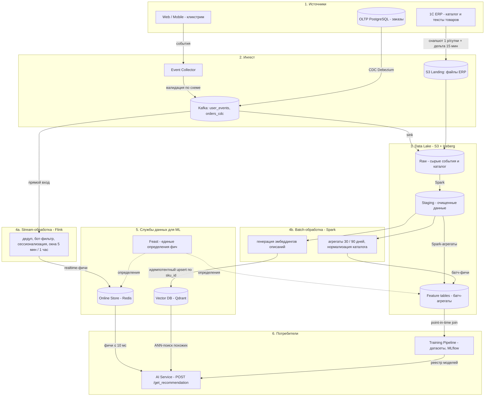
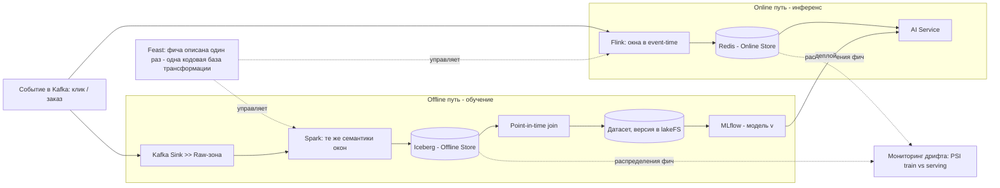

# Data Pipeline для системы рекомендаций TechnoMart: проектирование и выбор хранилищ

_Домашнее задание 5 - «Проектирование Data Pipelines и интеграционных шлюзов»._
_Кейс: «TechnoMart» - продолжение ДЗ-1 (стратегия, SLA, риски) и ДЗ-2 (C4-архитектура и OpenAPI сервиса рекомендаций `POST /get_recommendation`)._

Цель: спроектировать data pipeline и выбрать хранилища так, чтобы данные о товарах и поведении пользователей обновлялись регулярно, а модель обучалась и инференсировалась на консистентных данных (без training-serving skew).

---

## 0. Контекст и ключевые нефункциональные требования

В ДЗ-2 спроектирован AI Recommendation Service с горячим путём «precompute кандидатов + realtime re-ranking» (p95 < 200 мс). Теперь проектируется data-слой под него - от источников до датасетов и фич. Ограничения, унаследованные из ДЗ-1/ДЗ-2:

| # | Требование | Значение | Откуда |
|---|---|---|---|
| Н1 | Свежесть поведенческих фич | событие >> Online Store ≤ 30 сек (персонализация в рамках сессии) | специфика рекомендаций |
| Н2 | Обновление каталога | полный снапшот 1 р/сутки, дельта цен/остатков каждые 15 мин | ДЗ-2 (синк с 1C ERP) |
| Н3 | Latency горячего пути | p95 < 200 мс, из них чтение фич ≤ 10 мс | ДЗ-1/ДЗ-2 |
| Н4 | Консистентность train/serving | training-serving skew недопустим - единый код фичей | критерий ДЗ-5 |
| Н5 | ПДн | закрытый контур, псевдонимизация, ФЗ-152 | риск №4 из ДЗ-1 |
| Н6 | Команда | 2–3 ML-инженера, нет выделенной data-platform-команды | ДЗ-1 |

---

## 1. Шаг 1 - Data Sources

| Источник | Тип | Транспорт | Формат | Периодичность | Масштаб |
|---|---|---|---|---|---|
| Кликстрим: просмотры, клики, корзина, поиск (web + mobile) | Stream | Event Collector >> Kafka, топик `user_events` | Avro + Schema Registry | непрерывно, пики 3–5 тыс. соб/с | ~50–100 ГБ/сутки сырых |
| Заказы OLTP (PostgreSQL) | Stream (CDC) | Debezium >> Kafka, топик `orders_cdc` | Avro (CDC-события) | непрерывно | тысячи заказов/час |
| Каталог товаров: SKU, цены, остатки, категории | Batch | файловая выгрузка 1C >> S3 Landing | CSV/JSON (снапшот + дельта) | снапшот 1 р/сутки, дельта 15 мин | ~1–5 млн SKU |
| Тексты товаров: название, описание, атрибуты | Batch | вместе с каталогом | текст | вместе с каталогом | источник для эмбеддингов |

Почему так: поведение пользователя критично по свежести (рекомендация должна учитывать клики текущей сессии - Н1), поэтому кликстрим и заказы идут потоком через брокер. Каталог из 1C - интеграция с унаследованной системой: ERP физически не публикует события, файловый обмен - её ограничение, поэтому каталог принимается батчем. Брокер (Kafka) при этом служит отказоустойчивым буфером: пики кликстрима и недоступность потребителей не роняют источник (проектирование отказоустойчивых интеграций через брокер сообщений).

---

## 2. Шаг 2 - Pipeline Design

### 2.1 Почему ELT, а не ETL

Для ML-платформы нельзя заранее знать, какие данные и фичи понадобятся следующим моделям и экспериментам. Поэтому сырые данные загружаются в озеро как есть (неизменяемый Raw-зона), а очистка и трансформация выполняются по мере необходимости из озера - переиспользуемо, без перевыгрузок из источников. Это соответствует рекомендациям лекции: для AI-решений - преимущественно ELT + Data Lake/Lakehouse [1].

### 2.2 Схема end-to-end (Diagram)

Зоны озера: Raw (бронза) - сырые события и файлы ERP без изменений; Staging (серебро) - очищенные, дедуплицированные, нормализованные данные; Feature tables (золото) - агрегаты уровня фич. В таблицах Iceberg - это же Offline Store для Feast.

### 2.3 Где происходит очистка

1. На входе: Event Collector валидирует каждое событие по схеме из Schema Registry (Avro, политика совместимости BACKWARD) - битые события в карантин-топик, а не в пайплайн.
2. В stream-обработке (Flink): дедупликация по event_id, фильтрация ботов, нормализация атрибутов, сессионализация, realtime-агрегаты в event-time с watermark (корректные окна при опоздавших событиях).
3. В batch-обработке (Spark): полная очистка Staging-слоя - дедуп, согласование каталога с заказами (SKU-справочник), исправление конфликтов дельт.
4. DQ-гейты между слоями: Great Expectations на переходах Raw >> Staging >> Feature tables (полнота, уникальность ключей, допустимые диапазоны цен, доля NULL); упавшие проверки - карантин + алерт, дальше слой не пускают.

### 2.4 Где генерируются эмбеддинги

Эмбеддинги товаров генерируются батч-джобой Spark после очистки каталога: текст «название + описание + атрибуты» >> embedding-модель >> вектор пишется в Qdrant идемпотентным upsert по `sku_id` с версией embedding-модели в payload. Триггеры пересчёта: поступившая дельта каталога (15 мин >> очередь на пере-эмбеддинг изменённых SKU) и смена embedding-модели (полный пересчёт, новая версия векторов).

Эмбеддинги пользователей как отдельная сущность не материализуются: сиюминутный интерес пользователя представлен realtime-фичами в Redis (окна 5 мин/1 час), а долгосрочный - батч-агрегатами 30/90 дней. Realtime-генерация эмбеддингов на горячем пути исключена сознательно - она несовместима с Н3.

### 2.5 Stream vs Batch: Lambda или Kappa

| | Lambda (две ветки + два кода) | Kappa (всё через поток) | Выбор TechnoMart |
|---|---|---|---|
| Логика фич | дублируется в batch и speed-слое >> главный источник training-serving skew | одна кодовая база | Kappa-идеология для поведенческих данных: один Flink-код, ретроспектива - replay топика и пересчёт из Raw-зоны |
| Источники | любые | только потоковые | + батч-ингест для ERP: каталог принимается файлом, т.к. 1C не публикует события |
| Сложность | две системы в поддержке | требует зрелого стриминга | Flink только для realtime-фич, тяжёлая подготовка датасетов - в Spark по озеру |

Итог: прагматичный гибрид на базе Kappa [2] - потоковая ветка для кликстрима и CDC, батч-ветка для унаследованного ERP; обе ветки питают единый Feature Store. Классическая Lambda с дублированием логики отклонена именно из-за риска skew (критерий Н4).

---

## 3. Шаг 3 - Storage Selection

### 3.1 Карта хранилищ

| Этап | Технология | Почему выбрана | Отклонённые альтернативы |
|---|---|---|---|
| Шина событий | Apache Kafka | replay и retention (можно перечитать историю для пересчёта фич), партиционирование по user_id, экосистема Connect + Schema Registry | RabbitMQ - нет replay/партиций для аналитики; облачные шины - lock-in |
| Data Lake | S3-совместимое хранилище + Apache Iceberg | дешёвое хранение сырых данных; Iceberg даёт ACID, эволюцию схем и time travel - воспроизводимость датасетов для аудита моделей | сразу DWH - дорого для сырых событий и жёсткая схема; Delta/Hudi - аналоги, Iceberg нейтрален к движкам |
| Stream-обработка | Apache Flink | event-time и водяные знаки, exactly-once, stateful сессии - корректные realtime-фичи | Spark Structured Streaming - микробатчи, выше latency фич (Н1); Kafka Streams - тяжёлые джойны масштабировать сложнее |
| Batch-обработка | Apache Spark | стандарт для подготовки датасетов: SQL + ML-библиотеки, тот же движок читает Iceberg | dbt - только SQL, без ML; самописные скрипты - не масштабируются |
| Feature Store | Feast (offline: Iceberg, online: Redis) | open-source, единые определения фич, point-in-time joins, готовые плагины Redis/Iceberg, on-prem в закрытом контуре | Tecton / Databricks FS - managed, дороже и данные уходят из контура (Н5); Hopsworks - тяжёлая платформа для 2–3 инженеров (Н6) |
| Online Store | Redis | чтение фич p99 < 10 мс (Н3), TTL для сессионных фич, уже в ландшафте TechnoMart | Cassandra - избыточно; DynamoDB - managed, lock-in |
| Vector DB | Qdrant | фильтрующий ANN-поиск (фильтры по категории/цене поверх векторов), self-hosted в закрытом контуре, выбран ещё в ДЗ-2 | Pinecone - managed, данные уходят из контура (Н5); pgvector - ограничен по масштабу ANN-нагрузки |
| Аналитика событий (опц.) | ClickHouse | интерактивные отчёты продуктовых аналитиков по событиям | ad-hoc SQL к Iceberg через Trino - медленнее для интерактива |

### 3.2 Взвешенная матрица выбора стека

Сравнение трёх стратегий поставки стека (масштаб 1–5):

| Критерий (вес) | Managed Cloud (Confluent/Databricks/S3/Pinecone) | Self-hosted OSS целиком | Гибрид |
|---|---|---|---|
| Соответствие НФТ: latency и свежесть фич (0.20) | 5 | 4 | 5 |
| ПДн и закрытый контур, ФЗ-152 (0.25) | 3 | 5 | 4 |
| TCO на 3 года (0.20) | 2 | 4 | 3 |
| Компетенции команды, 2–3 ML-инженера (0.15) | 5 | 2 | 4 |
| Скорость запуска MVP (0.10) | 5 | 3 | 4 |
| Отсутствие vendor lock-in (0.10) | 2 | 5 | 4 |
| Взвешенная сумма | 3.60 | 3.95 | 4.00 |

Итог: гибрид - OSS-ядро (Kafka, Flink, Spark, Feast, Redis, Qdrant) на собственной инфраструктуре/K8s, где живут данные фич и ПДн; S3-совместимое объектное хранилище для озера. Trigger пересмотра: если требование закрытого контура (Н5) уйдёт, а команда вырастет - переход на managed-платформу (Databricks/Tecton + Pinecone) станет выгоднее.

### 3.3 Feature Store: нужен ли и какой

Для инференса нужны семантически те же данные, что и при обучении (агрегаты поведения пользователя); требования к latency online-чтения жёсткие (Н3); фичи переиспользуются несколькими моделями (ranking, similar items, предсказание CTR). Поэтому Feature Store нужен, и это Feast: offline-ветка (Iceberg) - для обучения с point-in-time join, online-ветка (Redis) - для инференса, определения фич - один репозиторий в Git.

---

## 4. Шаг 4 - Data Governance: консистентность обучения и инференса

### 4.1 Единый путь фичи (Diagram)

### 4.2 Механизмы против training-serving skew

1. Единое определение фичи. Каждая фича описана один раз в Feast-репозитории (Git): и обучающий пайплайн, и онлайн-сервис получают фичу по одному определению. Это исключает главную причину skew - расхождение кода трансформации.
2. Один сырой источник. Online-ветка (Flink) и offline-ветка (Kafka Sink >> Iceberg >> Spark) читают одни и те же события из Kafka: данные идентичны по построению, различается только скорость обработки. Одинаковые семантики окон (event-time, одинаковые границы и единицы) зафиксированы в контракте фичи.
3. Point-in-time correctness. Датасеты собираются через `get_historical_features`: для каждого события обучения берутся значения фич, реально существовавшие на тот момент - нет утечки будущего и «идеальных» фич, которых не было в проде.
4. Freshness SLA. Событие >> Redis ≤ 30 сек (Н1), мониторинг lag consumer group; батч-фичи помечены свежестью, сервис при устаревании деградирует к базовым фичам (холодный старт из ДЗ-2), а не отдаёт протухшие.
5. Мониторинг дрифта. Регулярное сравнение распределений фич online (Redis) против train (Iceberg) метрикой PSI; алерт при расхождении - сигнал skew или дрейфа данных до падения качества модели.
6. Консистентность каталога и векторов. Идемпотентные upsert по `sku_id`, tombstone для удалённых SKU, reconciliation-джоба сверяет Iceberg ↔ Qdrant (состав SKU и версии векторов), версия embedding-модели хранится в payload вектора.

### 4.3 Качество, lineage, версионирование, безопасность

| Область | Механизм |
|---|---|
| Data Quality | контракты данных (Schema Registry, BACKWARD-совместимость), DQ-гейты Great Expectations между слоями озера, карантин битых записей |
| Data Lineage | OpenLineage >> DataHub: событие >> топик >> фича >> датасет >> модель; при инциденте качества видно, какие модели затронуты |
| Версионирование | сырые данные - snapshots Iceberg (time travel); датасеты - lakeFS/DVC; определения фич - Git; модели - MLflow Model Registry |
| Data Security | ПДн не попадает в события (псевдонимизация user_id хешем на входе), RBAC по слоям озера, шифрование at rest / in transit, LLM-контур закрыт (ДЗ-1/ДЗ-2) |

---

## Источники

1. Конспект лекции «12 Архитектура данных для AI-систем» (ОТУС, Лавров Д.) - локальный файл в этой папке.
2. Big Data School - «Архитектура Kappa»: https://bigdataschool.ru/blog/kappa-architecture/
3. Feast - документация (offline/online store, point-in-time joins): https://docs.feast.dev/
4. Apache Flink - «What is Apache Flink»: https://flink.apache.org/what-is-flink/
5. Apache Iceberg: https://iceberg.apache.org/
6. Qdrant - документация: https://qdrant.tech/documentation/
7. Debezium - документация CDC: https://debezium.io/documentation/
8. Great Expectations - документация: https://docs.greatexpectations.io/docs/home/
9. OpenLineage: https://openlineage.io/
10. Tecton - «What is a Feature Store?» (training-serving skew): https://www.tecton.ai/blog/what-is-a-feature-store/
