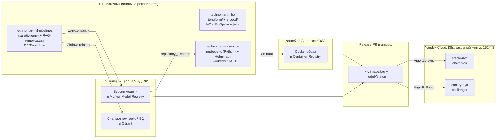
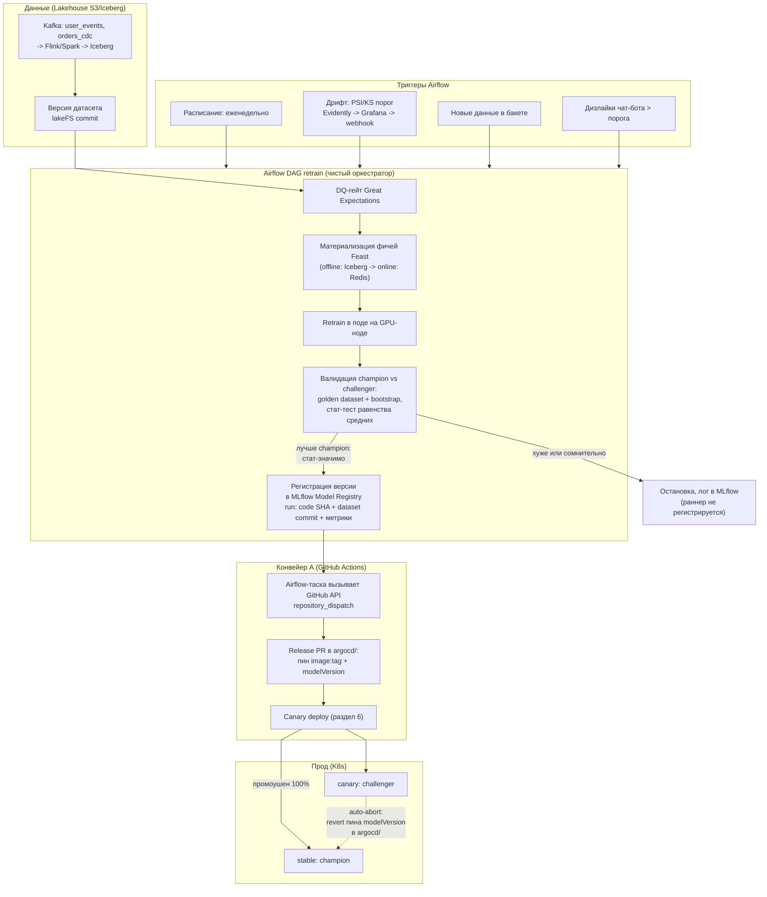
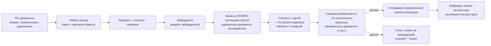
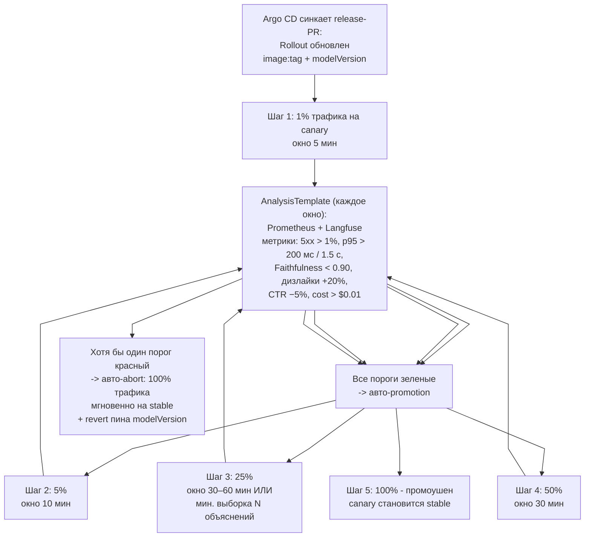

# Поставка AI-сервиса TechnoMart: IaC, CI/CD и MLOps-конвейеры

**Кейс:** TechnoMart - омниканальный ритейлер; сервис развивает AI Recommendation Service и RAG-контур генеративных объяснений (RAG - Retrieval-Augmented Generation, генерация, дополненная поиском по базе знаний)

**Цель:** автоматизированный пайплайн поставки AI-сервиса с интеграцией обучения моделей и Canary-релизом

---

## 0. Резюме

Поставка AI-сервиса TechnoMart построена как два независимых, но связанных конвейера:

- **Конвейер А «код»** (GitHub Actions + Argo CD): Commit -> Build Docker -> Unit Tests -> Security -> Deploy to Staging -> E2E Tests -> Deploy to Prod. Инференс-сервис - легкий образ без весов.
- **Конвейер Б «модель»** (Airflow + MLflow): триггеры (расписание / дрифт PSI / новые данные / дизлайки) -> Retrain на GPU -> валидация champion/challenger (bootstrap на golden set) -> MLflow Model Registry -> автоматический триггер конвейера А.
- **Точка интеграции артефактов:** release-PR в GitOps-репозиторий атомарно пинит пару `image:tag` (из Container Registry) + `modelVersion` (из MLflow). Инференс при старте подтягивает веса из MLflow в рантайме; при недоступности MLflow стартует с локально закэшированной версии (PVC - PersistentVolumeClaim, постоянный том Kubernetes на ноде).
- **Безопасность релиза:** полный набор гейтов (юнит, security, Ragas/DeepEval на golden set, E2E, смоуки) + Canary через Argo Rollouts: 1% -> 5% -> 25% -> 50% -> 100% с автоматическим анализом и мгновенным авто-откатом.
- **Автоматизация:** минорные ретрейны по дрифту проходят путь «данные -> прод» без единого ручного шага; единственный ручной шаг во всей схеме - approve release-PR при мажорной версии модели.

Транспорт: Yandex Cloud (закрытый контур по 152-ФЗ - закон «О персональных данных»), self-hosted все (LLM - large language model, большая языковая модель; MLflow, Qdrant, Langfuse, GitHub runner).

### Матрица соответствия критериям оценки

| Критерий | Где в решении |
|---|---|
| **Интеграция:** связь кода приложения и артефакта модели (Model Registry) | §5.3 (release-PR пинит `image:tag` + `modelVersion`), D3 (ребро Registry -> CI/CD и ребро отката), §5.4 (веса в рантайме + кэш), §5.2 (трассируемость dataset -> model -> code) |
| **Безопасность релиза:** этапы тестирования и стратегия Canary/Blue-Green | §4 (таблица quality gates), §6 (Canary 1->5->25->50->100%, таблица метрик отката, авто-abort), §6.4 (Blue-Green для мажорных движковых релизов) |
| **Автоматизация:** минимум ручных действий | §7 «Минимум ручных действий» (0 шагов для минорных ретрейнов, 1 approve для мажорных) |

---

## 1. Контекст и принципы решения

### 1.1. Что уже спроектировано и берется как данность

- **Сервис:** AI Recommendation Service - гибрид collaborative filtering + rules (SLO - Service Level Objective, целевой уровень качества сервиса; горячего пути p95 < 200 мс) и RAG-контур генеративных объяснений `GET /v1/explanations` (асинхронный, SLO p95 ≤ 1,5 с, uptime 99,9%). API отдает `modelVersion` - это база канареечных релизов моделей.
- **Стек данных:** Lakehouse S3/Iceberg, Kafka (user_events, orders_cdc), Flink/Spark, Feast (offline Iceberg / online Redis), Qdrant self-hosted, MLflow Model Registry, lakeFS для версий датасетов, Great Expectations для DQ-гейтов.
- **Наблюдаемость:** kube-prometheus-stack + Loki + Tempo, Langfuse self-hosted, Alertmanager -> Telegram; релизные гейты качества: Faithfulness ≥ 0.90, Answer Relevancy ≥ 0.75, Context Precision ≥ 0.80, Context Recall ≥ 0.85, toxicity = 0 (DeepEval), golden set ~100 QA-кейсов в git.
- **Ограничения:** 152-ФЗ закрытый контур - LLM, MLflow, Qdrant, Langfuse только self-hosted; команда 2–3 ML-инженера без выделенной platform-команды; облако - Yandex Cloud.

### 1.2. Принципы, на которых построена схема

1. **Веса модели и инференс-код - разные артефакты с разными релизными циклами.** Ретрейн по дрифту может случаться ежедневно, движок меняется раз в месяц (и наоборот); схлопывать их в один релиз - замедлять оба. Поэтому модель поставляется через Model Registry, а инференс - легким Docker-образом, и они связываются только в точке деплоя.
2. **Веса не путешествуют с кодом.** Тяжелые веса не хранятся ни в git, ни в реестре образов: их место - Model Registry с API и версионированием; инференс-под подтягивает нужную версию в рантайме.
3. **Обучение недетерминировано - сравнение моделей статистическое.** Решение «новая модель лучше» принимается не по одной цифре, а по распределению метрик на golden dataset (bootstrap, стат-тест), в парадигме champion/challenger.
4. **Канарейка ценна моделью оценки, а не механикой веса.** Переключить 10% трафика - примитив; ценность дают четкие метрики, пороги и когорты сравнения - поэтому центр схемы канарейки это AnalysisTemplate, а не вес в роутинге.
5. **Тесты гоняются там, где будет прод.** Self-hosted runner внутри закрытого контура: тестовые прогоны выполняются в той же среде, где лежат веса и данные с ПДн (персональные данные), без ручной синхронизации сред (которая рано или поздно нарушается).
6. **Автоматизированный rollback - часть поставки, не «пожарная команда».** Любой релиз считается незавершенным, пока не подтвержден метриками после выкатки; откат трафика и откат пина модели - автоматические.
7. **Человеческое ревью - точечно.** Один approve на мажорный релиз модели; все остальное событийно.

---

## 2. Общая картина: два релизных цикла

**D1. Ландшафт поставки TechnoMart AI**



Репозитории - три:

1. **technomart-infra** - `terraform/` (инфраструктура, §3) + `argocd/` (GitOps-конфиги, Helm values, Rollouts, AnalysisTemplate). Один репозиторий с двумя подпайплайнами: при команде 2–3 инженера отдельный GitOps-репозиторий не окупается.
2. **technomart-ml-pipelines** - код обучения и RAG-индексации + DAG'и Airflow. Люди: дата-сайентисты.
3. **technomart-ai-service** - инференс (Python), Helm-чарт, GitHub Actions workflow, интеграционные тесты. Люди: ML-инженеры/разработчики.

Разделение обучения и инференса по разным репозиториям - несущее: у них разные темпы изменений, разные стандарты качества и разные ответственные; попытка держать все в монорепе упирается в то, что исследовательский ML-код не выдерживает продакшн-стандартов инференса, а единый конвейер замедляет оба релизных цикла.

---

## 3. Раздел 1. Infrastructure as Code (Terraform)

### 3.1. Что поднимается автоматически

Псевдокод `terraform/main.tf` (Yandex Cloud). Рабочий каркас - в Приложении А.

```hcl
# ============ technomart-infra/terraform/main.tf (псевдокод) ============

terraform {
  backend "s3" {                       # state в Object Storage (S3-совместимый API)
    bucket   = "technomart-tf-state-prod"
    key      = "infra.tfstate"
    endpoint = "https://storage.yandexcloud.net"
    region   = "ru-central1"
    use_lockfile = true                 # нативная блокировка стейта (Terraform >= 1.10)
    # backend не интерполирует переменные: для staging - init с -backend-config
  }
  required_providers {
    yandex = { source = "yandex-cloud/yandex" }
  }
}

provider "yandex" {
  cloud_id  = var.cloud_id
  folder_id = var.folder_id
  # токен сервисного аккаунта ci-infra (права только на нужные типы ресурсов)
  service_account_key_file = var.sa_key_file
}

# ---- Сеть: скелет, на который навешивается все остальное ----
resource "yandex_vpc_network" "main" {}

# Подсеть для K8s-нод (nat = true: ноды без публичных IP, но с исходящим доступом)
resource "yandex_vpc_subnet" "k8s" {
  network_id     = yandex_vpc_network.main.id
  v4_cidr_blocks = ["10.10.0.0/20"]
  zone           = "ru-central1-a"
}

# Изолированная подсеть для data-tier (Postgres, MLflow, Qdrant) - доступ только изнутри
resource "yandex_vpc_subnet" "data" {
  network_id     = yandex_vpc_network.main.id
  v4_cidr_blocks = ["10.20.0.0/24"]
  zone           = "ru-central1-a"
}

# ---- Kubernetes: управляемый кластер + группы нод ----
resource "yandex_kubernetes_cluster" "prod" {
  name        = "technomart-${var.env}"          # один конфиг -> staging и prod (workspaces)
  network_id  = yandex_vpc_network.main.id
  # master regional, версия k8s пинится в variables.tf

  # service accounts для нод и для CSI (создаются ниже)
}

# CPU-ноды: инференс, Airflow, MLflow, Langfuse, Feast-онлайн (Redis), Qdrant
resource "yandex_kubernetes_node_group" "cpu" {
  cluster_id = yandex_kubernetes_cluster.prod.id
  size       = var.cpu_nodes # 3–6

  instance_template {
    resources { cores = 8, memory = 32 }
  }
}

# GPU-ноды: retrain (конвейер Б) + self-hosted LLM для объяснений
resource "yandex_kubernetes_node_group" "gpu" {
  cluster_id = yandex_kubernetes_cluster.prod.id
  size       = var.gpu_nodes # 1–2; масштабирование под ретрейн - Cluster Autoscaler (вне TF)

  instance_template {
    resources { cores = 16, memory = 128, gpus = 1 }
    # taint: workload=training/llm - чтобы ретрейн и LLM не съели CPU-ноды
  }
}

# ---- Хранилища: S3-бакеты ----
resource "yandex_storage_bucket" "lake" {
  bucket = "technomart-lake-${var.env}"      # Iceberg: raw / staging / feature
}
resource "yandex_storage_bucket" "mlflow_artifacts" {
  bucket = "technomart-mlflow-${var.env}"    # артефакты и веса моделей MLflow
}
resource "yandex_storage_bucket" "qdrant_snapshots" {
  bucket = "technomart-qdrant-snap-${var.env}" # снапшоты векторной БД (retention >= 3)
}
# Бакет стейта (technomart-tf-state-prod) создается один раз вне этого конфига:
# Terraform не может создать бакет, в котором лежит его собственный стейт

# ---- Container Registry для Docker-образов конвейера А ----
resource "yandex_container_registry" "main" {
  name = "technomart-${var.env}"
}

# ---- Managed Postgres: бэкенд MLflow + метаданные Airflow.
#      БД живет отдельно: Terraform поднимает ее пустой один раз и больше не трогает ----
resource "yandex_mdb_postgresql_cluster" "meta" {
  name        = "technomart-meta-${var.env}"
  network_id  = yandex_vpc_network.main.id
  environment = "PRODUCTION"
  # подсеть data: доступ только из закрытого контура
}

# ---- Сервисные аккаунты с минимальными правами ----
resource "yandex_iam_service_account" "ci_infra"  { name = "ci-infra" }  # деплой инфраструктуры
resource "yandex_iam_service_account" "k8s_nodes" { name = "k8s-nodes" } # бакеты/registry для нод
resource "yandex_iam_service_account" "airflow"   { name = "airflow" }   # S3/Iceberg, MLflow

# ---- Секреты: Lockbox, не в git ----
resource "yandex_lockbox_secret" "mlflow_backend" {
  name = "mlflow-backend-db"
}

# ---- Security groups: закрытый контур ----
# ingress: только из VPC + VPN-шлюз для администраторов; egress nat=true для нод
```

### 3.2. Политика IaC

- **State** - в S3-бакете с блокировкой; потеря стейта означает рассинхрон «что в конфиге - то и в облаке», поэтому бакет стейта защищен от удаления (lifecycle-политика) и бэкапится.
- **Один конфиг - много окружений**: `terraform workspace` / tfvars на staging и prod; то, что прошло на staging, гарантированно совпадает с prod.
- **Цикл:** `validate` -> `plan` (сухой прогон, обязательный гейт в CI) -> `apply` (ручной approve в GitHub Environment «infra-prod») -> `destroy` только для эфемерных тестовых окружений.
- **Секреты** - Yandex Lockbox/Vault, в git не попадают; доступ к прод-инфраструктуре - только через сервисную роль ci-infra, у людей право изменения конфигурации отобрано.
- **Ручные правки в консоли будут перетерты** следующим apply - правило доводится до команды как регламент.
- **Когда Terraform запускается в пайплайне:** если код требует нового железа (больше памяти/GPU) - сначала apply Terraform, затем деплой кода и тесты.

### 3.3. Разделение труда IaC vs CI/CD

Terraform отвечает за создание ресурсов, GitHub Actions - за проверку и доставку кода. Связка в одной точке: `terraform apply` кладет в K8s только «пустую» платформу (кластер, ноды, namespace'ы, CRD Argo Rollouts - Custom Resource Definition, кастомный тип ресурса Kubernetes); все прикладное приезжает GitOps-синком Argo CD из `argocd/`. Если инфраструктуры недостаточно под новый релиз, пайплайн сначала применяет изменение Terraform, потом катит код.

---

## 4. Раздел 2. CI/CD Pipeline (конвейер А - код)

**D2. Пайплайн поставки кода** (базовая цепочка - требуемая; Security и качество AI-ответов - дополнительные гейты поверх нее)

```mermaid
%%{init: {'flowchart': {'curve': 'linear'}}}%%
flowchart TD
    C["Commit / PR в technomart-ai-service"]
    LINT["Гейт 0: линтеры + IaC plan<br/>(ruff, helm lint, terraform plan)"]
    BUILD["Build Docker<br/>легкий образ БЕЗ весов<br/>-> Container Registry"]
    UNIT["Unit Tests<br/>(контракт формы ответа API)"]
    SEC["Security Gates<br/>(SonarQube, trivy: CVE и секреты,<br/>канареечные промпты: PII не выходит)"]
    STG["Deploy to Staging<br/>(Argo CD, auto-sync)"]
    E2E["E2E Tests<br/>(сквозные сценарии на staging,<br/>self-hosted runner в контуре)"]
    MQG["Гейт качества AI-ответов<br/>Ragas: Faithfulness ≥ 0.90,<br/>Answer Relevancy ≥ 0.75,<br/>Context P ≥ 0.80 / R ≥ 0.85<br/>DeepEval toxicity = 0<br/>golden set ~100 QA из git"]
    SMOKE["Smoke Tests<br/>(сервис стартует, нет зацикливаний,<br/>опрос всех вершин графа)"]
    REL["Release PR в argocd/<br/>пин image:tag (+modelVersion)"]
    APPROVE["Мерж release-PR:<br/>авто при зеленых гейтах;<br/>approve - только мажорная<br/>версия модели"]
    PROD["Deploy to Prod<br/>Argo Rollouts: Canary 1% -> 5% -> 25% -> 50% -> 100%"]
    OBS["Оценка после выкатки<br/>SLO-дашборды + Langfuse<br/>авто-rollback при нарушении"]

    C --> LINT --> BUILD --> UNIT --> SEC --> STG --> E2E --> MQG --> SMOKE --> REL --> APPROVE --> PROD --> OBS
    OBS -.->|"плохие метрики: rollback"| STABLE_SPIN["Возврат на stable-версию<br/>автоматически"]
```



### 4.1. Таблица quality gates

| Этап | Инструмент | Критерий провала |
|---|---|---|
| Линтеры | ruff, helm lint, terraform validate/plan | ошибка синтаксиса/конфига |
| Build Docker | docker build -> YC Container Registry | образ не собирается; образ > 2 ГБ (сигнал, что веса влезли в образ - запрещено) |
| Unit Tests | pytest | падение теста; нарушение контракта формы ответа |
| Security | SonarQube (SAST), trivy (CVE, секреты), скан канареечных промптов | критическая CVE; секрет в коде; модель отвечает чувствительными данными без маскирования |
| Deploy Staging | Argo CD auto-sync | health-check подов |
| E2E Tests | pytest + playwright, self-hosted runner | падение сквозного сценария |
| Качество AI-ответов | Ragas + DeepEval на golden set | любой порог ниже значений из §1.1 (0.90 / 0.75 / 0.80 / 0.85, toxicity > 0) |
| Smoke | прогон полного графа сервиса | зацикливание, недостижимые вершины, не поднимаются зависимости |

Ключевые свойства этапов:

- **Self-hosted runner внутри закрытого контура.** Раннер установлен на ноде в том же K8s, где будет прод. Тесты гоняются в среде, где лежат веса и golden-данные с ПДн - облачные раннеры GitHub неприемлемы по 152-ФЗ, а ручная синхронизация тестовой среды с продом не нужна и не возникает.
- **Образ без весов.** Артефакт конвейера А - легкий инференс-образ; веса - артефакт конвейера Б в MLflow. Это делает сборку быстрой, а фича-флаги (§5.5) - возможными.
- **Deploy to Prod - не конец пайплайна.** За ним идет обязательная оценка после выкатки: выкатка без привязки к мониторингу и без автоматизированного отката считается непоставляемой - см. §6.

### 4.2. GitOps-поток

Argo CD следит за каталогом `argocd/` репозитория technomart-infra и приводит кластер к состоянию из git. Все выкатки в staging и prod - это коммит; раскатку руками никто не делает. Не путать: Argo CD - GitOps-синк состояния кластера, Argo Rollouts - механика canary-релизов внутри кластера (§6).

### 4.3. Ключевые job'ы GitHub Actions

```yaml
# technomart-ai-service/.github/workflows/ci.yml (фрагмент)
name: ai-service-ci
on:
  push: { branches: [main, release] }
  pull_request:
jobs:
  build-test:
    runs-on: [self-hosted, technomart]   # раннер в закрытом контуре
    steps:
      - uses: actions/checkout@v4
      - name: Lint + Terraform plan (если тронут infra)
        run: make lint && terraform -chdir=terraform plan -detailed-exitcode || true
      - name: Build Docker (без весов!)
        run: docker build -t cr.yandex/technomart/ai-service:${GITHUB_SHA::7} .
      - name: Unit tests
        run: pytest tests/unit
      - name: Security (SAST + CVE + секреты + канареечные промпты)
        run: sonar-scanner && trivy image --exit-code 1 --severity CRITICAL \
             cr.yandex/technomart/ai-service:${GITHUB_SHA::7} && python -m testing.canary_prompts
      - name: Push image
        run: docker push cr.yandex/technomart/ai-service:${GITHUB_SHA::7}

  e2e-staging:                          # после auto-deploy в staging
    needs: build-test
    runs-on: [self-hosted, technomart]
    environment: staging
    steps:
      - run: pytest tests/e2e --staging-url $STAGING_URL
      - name: AI quality gate (Ragas/DeepEval, golden set из git)
        run: python -m testing.pre_deploy_test
        env:
          THRESH_FAITHFULNESS: "0.90"
          THRESH_ANSWER_RELEVANCY: "0.75"
          THRESH_CONTEXT_PRECISION: "0.80"
          THRESH_CONTEXT_RECALL: "0.85"
          THRESH_TOXICITY: "0"

  release:                              # мерж release-PR -> canary в проде (§6)
    if: github.ref == 'refs/heads/release'
    runs-on: [self-hosted, technomart]
    environment: production             # минорные версии: авто-мерж ботом;
                                        # мажорные: protected env с ручным approve
    steps:
      - run: ./scripts/open_release_pr.sh   # пин image:tag (+modelVersion) в argocd/
```

---

## 5. Раздел 3. MLOps Integration (конвейер Б - модель)

**D3. Цикл обучения и его интеграция с CI/CD** - сценарий «обновился датасет -> Airflow Trigger -> Retrain -> Model Registry -> Trigger CI/CD» реализован целиком, плюс ребро отката



### 5.1. Триггеры ретрейна

| Триггер | Детектор | Частота/порог |
|---|---|---|
| По расписанию | Airflow cron | еженедельно (базовый ритм) |
| Data drift | Evidently: PSI/KS/хи-квадрат распределений фичей -> отчет в Grafana -> webhook -> триггер DAG | PSI > 0.2 (значимый сдвиг) |
| Новые данные | сенсор новых коммитов lakeFS / объектов в бакете | по появлению |
| Деградация обратной связи | рост дизлайков чат-бота / падение CTR блока | дизлайк rate +20% к базовой неделе |

Airflow - «чистый оркестратор»: DAG'и запускают шаги пайплайна, но не содержат ML-логики внутри себя; вся логика обучения - в коде репозитория ml-pipelines, в подах (KubernetesExecutor). Прогон, не прошедший валидацию, все равно логируется в MLflow - при инциденте нужно уметь ответить, какие эксперименты отклонялись и почему.

### 5.2. Champion/challenger и статистика вместо «99 vs 98»

Решение о регистрации и промоушене модели принимается по распределению метрик, а не по одной цифре: на golden dataset (~100 QA из git, тот же, что в CI-гейте) прогоняются оба артефакта многократно (bootstrap), сравниваются распределения метрик (Faithfulness, Answer Relevancy, Context Recall, офлайн-прокси CTR), применяется стат-тест равенства средних. Challenger регистрируется в MLflow только если он стат-значимо не хуже champion. Каждый run в MLflow привязывает артефакт модели к code SHA и commit'у датасета (lakeFS) - получается полная трассируемая цепочка «данные -> модель -> код релиза», по которой инцидент разбирается за минуты.

### 5.3. Точка интеграции: артефакты кода и модели связываются в GitOps

1. Airflow-таска после регистрации версии в Model Registry вызывает GitHub API (`repository_dispatch { model_name, model_version, run_id }`) - нативных вебхуков у MLflow нет, поэтому триггер делает оркестратор.
2. GitHub Actions открывает release-PR в `argocd/`, который атомарно пинит в Helm values пару:

```yaml
# argocd/apps/ai-service/values-prod.yaml (генерируется release-PR)
image:
  tag: release-1.24.0          # артефакт конвейера А (Container Registry)
model:
  version: "champion@v47"      # артефакт конвейера Б (MLflow Model Registry)
  registry_uri: http://mlflow.data-tier:5000
```

3. Мерж этого PR - единственная точка, где код и модель связываются. Инференс-под при старте резолвит `model.version` через MLflow API и тянет веса в рантайме.
4. Правило мажор/минор задается тегом версии модели при регистрации: минор - ретрейн на той же архитектуре и той же схеме фичей; мажор - смена архитектуры, схемы фичей или самой LLM. Минорные release-PR мержатся ботом автоматически при зеленых гейтах CI (auto-merge ветки `release`); мажорные требуют ручного approve в protected environment - это и есть единственный ручной шаг всей схемы (§7).

### 5.4. Registry не должен быть SPOF инференса (single point of failure - единая точка отказа)

Известный риск схемы «веса отдельно»: реестр моделей по своей природе часто допускает деградацию (может отвечать медленно или временно лечь), а инференс-сервис ожидает от него данные на старте. Контрмеры:

- Локальный кэш весов на ноде (PVC - PersistentVolumeClaim, «заявка на постоянный том»: диск в Kubernetes, не зависящий от жизненного цикла пода; том привязан к ноде и общий для всех подов этой ноды): под стартует с последней закэшированной версии, если MLflow недоступен; расхождение с пином - алерт `ModelCacheStale > 24h`.
- Веса грузятся по слоям, кусками - защита от OOM-killed (принудительное завершение контейнера при нехватке памяти) при попытке загрузить весь файл в RAM разом.
- Ретрейн-нода забирает веса напрямую из бакета (S3-путь MLflow), а не через API-путь инференса - нагрузка на registry от обучения не влияет на инференс.

### 5.5. A/B-механика для частых релизов весов: фича-флаги

Когда веса обновляются часто (ретрейн по дрифту), полноценная канарейка на каждую версию избыточна. Альтернативный механизм: инференс заранее умеет держать в памяти две модели (champion + challenger) и раутить запросы по хэшу пользователя (MurmurHash) - доли когорт управляются дистанционно фича-флагом, без деплоя. Это работает только потому, что веса поставляются отдельно от образа (§5.3). Минусы фиксируем честно: нужно больше памяти на инстансе (две модели), флаги надо поддерживать в кодовой базе. В основной схеме TechnoMart фича-флаги - механизм A/B-экспериментов и «горячей» подмены модели; канарейка (§6) - механизм релизов движка и мажорных версий модели.

### 5.6. RAG-подконтур: автообновление векторной базы

Для RAG-контура «переобучения» нет - LLM предобученная; версионируется и обновляется векторная база.

**D4. Airflow DAG reindex (еженедельно + по сенсору документов)**



Метрики контура и автотриггеры: время поиска в Qdrant (медиана/p95), доля запросов с similarity ниже порога, лайки/дизлайки - в Grafana. При деградации RAG первой реакцией будет откат снапшота (переобучение здесь не помощник - модель эмбеддингов не менялась); причины ищут по метаданным: источник, время загрузки, способ чанковки, где лежат тексты. Отслеживаются все типы изменений документов: новые, измененные и удаленные - база всегда актуальна.

---

## 6. Раздел 4. Release Strategy: Canary

### 6.1. Механика переключения трафика

Инструмент - Argo Rollouts (canary-стратегия; в стандартном Kubernetes ее из коробки нет). Трафик режется по весам между stable и canary-пулами; для консистентности пользовательского опыта доли выравниваются по хэшу пользователя, чтобы один человек не метался между версиями.

**D5. Canary-релиз с авто-анализом и авто-откатом**



Почему окна именно такие: SLO-метрики (5xx, латентность) статистику в окне набирают быстро и анализируются по времени; качественные и бизнес-метрики (faithfulness на живой выборке, dislike rate, CTR-прокси) на канарейке с малой долей асинхронного трафика объяснений за 5 минут выборку не наберут - для них условие промоушена «минимальная выборка N ИЛИ окно ≥ 30–60 минут», а накопление идет на шагах 25->50->100%. Рандомные проценты трафика сами по себе задачу не решают - вся ценность канарейки в критериях оценки, поэтому центр схемы это AnalysisTemplate и таблица порогов, а не вес в роутинге.

### 6.2. Метрики отката (rollback)

AnalysisTemplate опрашивает Prometheus (SLO) и Langfuse (качество LLM-ответов). Любое нарушение на любом шаге - авто-abort: 100% трафика мгновенно возвращается на stable, срабатывает алерт CanaryViolation (Alertmanager -> Telegram).

| Метрика | Порог отката | Источник данных | Категория |
|---|---|---|---|
| Error rate (5xx) | > 1% за окно | Prometheus | SLO, по времени |
| Латентность горячего пути | p95 > 200 мс | Prometheus | SLO, по времени |
| Латентность объяснений | p95 > 1,5 с | Prometheus | SLO, по времени |
| Guardrails/PII-срабатывания | > 0 на canary-когорте | Langfuse + Presidio | качество, по времени |
| Faithfulness на живой выборке | < 0.90 при N ≥ 100 ответов | Ragas по выборке Langfuse | качество, выборка/окно |
| Доля low-similarity запросов (RAG) | > 15% | Qdrant-метрики | качество, выборка/окно |
| Дизлайки | относительный рост ≥ +20% vs stable-когорта за то же окно | фидбек API | бизнес, выборка/окно |
| CTR блока рекомендаций (прокси AOV) | относительное падение ≥ 5%, bootstrap-интервал не пересекает 0 | аналитика событий | бизнес, выборка/окно |
| Cost per request | > $0.01 (бюджет на запрос) | Langfuse token usage × тариф | стоимость, по времени |

### 6.3. Откат модели - отдельная механика

Откат при канарейке возвращает трафик, но пин `modelVersion` в git тоже нужно вернуть - откат релиза это «предыдущий образ + предыдущая версия модели»:

1. **Автоматический путь:** авто-abort канарейки -> Argo Rollouts возвращает 100% на stable -> GitHub Actions автоматически открывает revert-PR пина `modelVersion` в `argocd/` (чтобы git соответствовал реальности).
2. **Откат уже промоушененной модели** (проблема обнаружена позже): revert release-PR пина (или `argocd app rollback` как временное действие + следом revert-PR). Локальный кэш весов (§5.4) делает откат быстрым - предыдущая версия уже на ноде.
3. **Для RAG-деградации:** откат алиаса Qdrant на предыдущий снапшот (D4) - до 3 версий назад (retention).

Нюанс ML-эксплуатации: первое действие при деградации качества - не обязательно откат. Если деградация вызвана дрифтом данных, «аналог перезапуска» - переобучение на свежих данных; откат деплоя уместен, когда деградацию вызвал конкретный релиз. Различие видно по трассируемости run <-> dataset <-> code (§5.2).

### 6.4. Blue-Green для мажорных релизов движка (альтернатива, строкой)

Выбор стратегии - по типу изменения: когда изменение несовместимо (новая схема фичей, смена контракта API, где частичный трафик недопустим) - Blue-Green: полный второй пул и мгновенное переключение всего трафика сетевыми средствами (service mesh/ingress). Цена - x2 железа, поэтому для обычных релизов используется canary, а blue-green - точечно, для мажорных движковых релизов. Важно, что канарейка и blue-green в ML-сервисах равноценны по приоритету - обе дают моментальный rollback; отличие в том, что канарейка дополнительно дает постепенное накопление оценок.

### 6.5. Shadow-тестирование (инструмент, а не релиз)

Для мажорных изменений движка перед release-PR запускается shadow-контур рядом с продом: часть прод-трафика зеркалится в него, ответы пользователям от него не идут. Это способ проверить новое поведение под реальной прод-нагрузкой, не затрагивая пользователей; после успешного shadow все равно выбирается стратегия раскатки (canary). Shadow не заменяет ни один из этапов схемы - это предпрод-оценка мажорных изменений.

### 6.6. Чек-лист релиза (сводный)

1. Артефакты готовы: образ в Registry (без весов), версия модели в MLflow со статусом, снапшот Qdrant со смоуками - зелеными.
2. Release-PR пинит `image:tag` + `modelVersion` (+ коллекцию-алиас Qdrant, если индексация менялась).
3. Golden set и канареечные промпты - зеленые на staging.
4. Canary: 1% -> 5% -> 25% -> 50% -> 100%, AnalysisTemplate зеленый на каждом шаге.
5. После 100%: 24 часа усиленного наблюдения (дашборд SLO & AI Quality), затем штатные авто-алерты.
6. Если что-то красное: авто-abort -> revert-PR пина -> разбор по MLflow run-метаданным (какой код, какой датасет, какие метрики).

---

## 7. Минимум ручных действий (критерий «Автоматизация»)

| Шаг | Ручной? | Комментарий |
|---|---|---|
| Триггер ретрейна (расписание/дрифт/данные/дизлайки) | нет | Airflow, событийно |
| DQ-гейт, retrain, валидация champion/challenger | нет | Airflow DAG |
| Регистрация версии в MLflow -> триггер CI | нет | repository_dispatch |
| Build Docker, юнит, security, deploy staging | нет | GitHub Actions |
| E2E + AI-quality гейты (Ragas/DeepEval) | нет | self-hosted runner |
| Создание release-PR с пинами | нет | генерируется автоматически |
| Мерж минорных release-PR (ретрейны) | нет | авто-мерж ботом при зеленых гейтах |
| Approve мажорной версии модели | да (1 шаг) | protected environment; правило мажор/минор - §5.3 |
| Canary-шаги, анализ, промоушен/abort | нет | Argo Rollouts + AnalysisTemplate |
| Откат (трафик + пин модели) | нет | авто-abort + авто-revert-PR |

Итог: 0 ручных шагов для минорного ретрейна по дрифту, 1 ручной шаг (approve) для мажорного релиза.

---

## 8. Глоссарий

### Термины и механики

| Термин | Значение |
|---|---|
| Champion / Challenger | текущая прод-модель, с которой сравнивают / модель-кандидат |
| CT (Continuous Training) | автоматизированное обучение моделей как часть конвейера |
| Canary | постепенное переключение доли трафика на новую версию с оценкой метрик (Argo Rollouts, service mesh) |
| Blue-Green | два полных окружения и мгновенное переключение всего трафика сетевыми средствами |
| Shadow | зеркалирование трафика на тестируемый контур без отдачи ответов пользователям; тестирование, не релиз |
| AnalysisTemplate | CRD Argo Rollouts: запросы к Prometheus/Langfuse, сравнение с порогами, promote/abort |
| Argo CD vs Argo Rollouts | GitOps-синк состояния кластера из git vs механика canary-релизов в кластере |
| Feature flag + MurmurHash | дистанционно управляемый routing запросов между версиями моделей по хэшу пользователя |
| Model Registry | хранилище версий моделей с API и версионированием; здесь - MLflow |
| PSI / KS-тест / хи-квадрат | статистические тесты дрейфа распределений: Population Stability Index, критерий Колмогорова-Смирнова, критерий хи-квадрат |
| Bootstrap | многократные перевыборки для сравнения распределений метрик |
| Golden dataset | доверенная тестовая выборка (~100 QA в git) для гейтов и сравнения моделей |
| Self-hosted runner | раннер GitHub Actions внутри закрытого контура; тесты там же, где прод |
| GitOps | желаемое состояние среды хранится в git; раскатка - синком Argo CD |
| LakeFS | версионирование датасетов в S3-озере (commit на датасет) |
| Release train | ритмичный релизный цикл кода, независимый от цикла весов модели |
| Под (pod) | минимальная единица развертывания в Kubernetes: контейнер (или группа контейнеров), работающий на ноде |
| Нода (node) | виртуальная машина в кластере Kubernetes; в этой схеме PVC-кэш весов привязан к ноде и общий для ее подов |
| Инференс | применение обученной модели к запросам (предсказания); здесь - легкий сервис без весов, веса подтягиваются из MLflow |
| Ретрейн | повторное обучение модели на свежих данных (по расписанию, дрифту, новым данным, дизлайкам) |
| Дрифт (drift) | сдвиг распределения входных данных относительно обучающей выборки; детектируется Evidently (PSI) |
| Пин | фиксация конкретной версии артефакта (тега образа, версии модели) в GitOps-конфиге; release-PR «пинит» пару `image:tag` + `modelVersion` |
| Гейт (quality gate) | автоматическая проверка-фильтр в конвейере: при провале пайплайн останавливается |
| Смоук-тест (smoke test) | быстрый базовый прогон «сервис работает в принципе» (стартует, отвечает, нет зацикливаний) перед глубокими проверками |
| Сенсор (Airflow sensor) | шаг DAG, который ждет внешнее событие (новые данные, коммит lakeFS) и только потом пропускает пайплайн дальше |
| Снапшот | зафиксированная копия состояния векторной базы Qdrant на момент времени, хранится в S3 |
| Промоушен | перевод canary-версии в stable (100% трафика) или challenger в champion |
| Прокси-метрика | замещающий показатель, коррелирующий с целевой бизнес-метрикой (CTR блока рекомендаций как прокси AOV) |
| Guardrails | защитные фильтры поверх LLM-ответов (маскирование ПДн, запрет тем); детектор - Presidio |
| Эмбеддинги | векторные представления текстов; из них строится векторная база Qdrant для RAG |
| Чанковка (chunking) | разбиение длинного документа на фрагменты (чанки) перед расчетом эмбеддингов |
| Service mesh / Ingress | инфраструктурный слой маршрутизации трафика между подами / извне кластера; им режется трафик по весам |
| Ragas-метрики (Faithfulness, Answer Relevancy, Context Precision/Recall) | метрики качества RAG: верность фактам из контекста, релевантность ответа, точность/полнота поданного контекста |
| repository_dispatch | тип события GitHub API: внешний сервис (Airflow-таска) запускает workflow в репозитории |

### Аббревиатуры

| Аббревиатура | Расшифровка |
|---|---|
| 5xx | класс HTTP-статусов «ошибка на стороне сервера» (500-599); в таблице отката - порог > 1% |
| 152-ФЗ | федеральный закон «О персональных данных» - причина закрытого контура и self-hosted |
| A/B | сплит-тест: трафик делится между вариантами, сравниваются метрики (§5.5) |
| AI | Artificial Intelligence, искусственный интеллект |
| AOV | Average Order Value, средний чек заказа |
| API | Application Programming Interface, программный интерфейс взаимодействия компонентов |
| CI/CD | Continuous Integration / Continuous Delivery (Deploy), непрерывные интеграция и доставка; здесь - конвейер А |
| CPU | Central Processing Unit, центральный процессор; «CPU-ноды» - ноды без GPU |
| CRD | Custom Resource Definition, кастомный тип ресурса Kubernetes (на нем построены Argo Rollouts и AnalysisTemplate) |
| CSI | Container Storage Interface, стандартный интерфейс подключения дисков/томов к Kubernetes |
| CVE | Common Vulnerabilities and Exposures, публичный реестр известных уязвимостей; trivy сканирует образ на CVE |
| CTR | Click-Through Rate, доля кликов: клики / показы блока рекомендаций |
| DAG | Directed Acyclic Graph, направленный ациклический граф; в Airflow - пайплайн из связанных шагов |
| DQ | Data Quality, качество данных; DQ-гейт - Great Expectations |
| E2E | End-to-End, сквозное тестирование полного пользовательского сценария |
| GPU | Graphics Processing Unit, графический ускоритель (ретрейн, self-hosted LLM) |
| HCL | HashiCorp Configuration Language, язык конфигурации Terraform |
| IaC | Infrastructure as Code, инфраструктура как код (Terraform, §3) |
| IAM | Identity and Access Management, управление доступом (сервисные аккаунты Yandex Cloud) |
| K8s | Kubernetes, оркестратор контейнеров («K» + 8 букв + «s») |
| LLM | Large Language Model, большая языковая модель |
| ML | Machine Learning, машинное обучение |
| MLOps | Machine Learning Operations, промышленная эксплуатация ML-систем; здесь - конвейер Б |
| OOM | Out Of Memory, нехватка памяти; OOM-killed - контейнер принудительно завершен из-за нехватки памяти |
| p95 | 95-й перцентиль времени ответа: 95% запросов быстрее этого значения |
| PII | Personally Identifiable Information, персонально идентифицирующие данные |
| PR | Pull Request, запрос на слияние веток в git; release-PR - PR с пином версий, revert-PR - откат пина |
| PVC | PersistentVolumeClaim, «заявка на постоянный том» Kubernetes: диск, живущий независимо от жизненного цикла пода; здесь - кэш весов на ноде, общий для ее подов (§5.4) |
| QA | Question-Answer, пара «вопрос-ответ»; golden set - ~100 QA-кейсов |
| RAG | Retrieval-Augmented Generation, генерация, дополненная поиском по векторной базе знаний |
| RAM | Random Access Memory, оперативная память |
| S3 | класс объектных хранилищ, совместимых с Amazon S3 API; в Yandex Cloud - Object Storage (бакеты) |
| SAST | Static Application Security Testing, статический анализ безопасности кода (SonarQube) |
| SHA | Secure Hash Algorithm; в тексте - хэш коммита git, идентификатор версии кода |
| SLO | Service Level Objective, целевой уровень качества сервиса (латентность p95, error rate, uptime) |
| SPOF | Single Point of Failure, единая точка отказа |
| TF | Terraform, инструмент IaC (в комментариях кода) |
| VPC | Virtual Private Cloud, изолированная виртуальная сеть в облаке |
| VPN | Virtual Private Network, защищенный канал для административного доступа в закрытый контур |
| YC | Yandex Cloud |
| ПДн | персональные данные |

## 9. Источники

- вспомогательные материалы: [Argo CD Architecture](https://argo-cd.readthedocs.io/en/stable/operator-manual/architecture/), [Canary Release - Martin Fowler](https://martinfowler.com/bliki/CanaryRelease.html).

---

## Приложение А. Terraform: рабочий каркас (валидный HCL)

Минимальный рабочий каркас (`technomart-infra/terraform/`): синтаксически валидный HCL (HashiCorp Configuration Language, язык Terraform) для провайдера YC, готовый к `terraform init/plan/validate` после подстановки своих `cloud_id`/`folder_id`/токена; не претендует на production-полировку.

```hcl
# provider.tf
terraform {
  required_version = ">= 1.10"
  backend "s3" {
    bucket   = "technomart-tf-state-prod"
    key      = "infra.tfstate"
    endpoint = "https://storage.yandexcloud.net"
    region   = "ru-central1"
    skip_credentials_validation = true
    skip_region_validation      = true
    skip_metadata_api_check     = true
    use_lockfile = true             # нативная блокировка стейта (Terraform >= 1.10)
  }
  required_providers {
    yandex = {
      source  = "yandex-cloud/yandex"
      version = "~> 0.140"
    }
  }
}

provider "yandex" {
  cloud_id                 = var.cloud_id
  folder_id                = var.folder_id
  service_account_key_file = var.sa_key_file
  zone                     = var.zone
}

# variables.tf (фрагмент)
variable "cloud_id" {
  type = string
}
variable "folder_id" {
  type = string
}
variable "zone" {
  type    = string
  default = "ru-central1-a"
}
variable "env" {
  type    = string
  default = "prod" # staging | prod: один конфиг, два окружения
}
variable "sa_key_file" {
  type      = string
  sensitive = true
}
variable "gpu_nodes" {
  type    = number
  default = 1
}
variable "cpu_nodes" {
  type    = number
  default = 3
}

# main.tf (фрагмент: сеть, K8s, GPU-ноды, бакеты, registry)
resource "yandex_vpc_network" "main" { name = "technomart-${var.env}" }

resource "yandex_vpc_subnet" "k8s" {
  name           = "k8s-${var.env}"
  zone           = var.zone
  network_id     = yandex_vpc_network.main.id
  v4_cidr_blocks = ["10.10.0.0/20"]
}

resource "yandex_vpc_subnet" "data" {
  name           = "data-${var.env}"
  zone           = var.zone
  network_id     = yandex_vpc_network.main.id
  v4_cidr_blocks = ["10.20.0.0/24"]
}

resource "yandex_kubernetes_cluster" "prod" {
  name        = "technomart-${var.env}"
  network_id  = yandex_vpc_network.main.id

  master {
    version = "1.29"
    regional {
      region = "ru-central1"
    }
    public_ip = false # master в закрытом контуре, доступ через VPN
  }

  service_account_id      = yandex_iam_service_account.k8s.id
  node_service_account_id = yandex_iam_service_account.nodes.id
}

resource "yandex_kubernetes_node_group" "cpu" {
  cluster_id = yandex_kubernetes_cluster.prod.id
  name       = "cpu-${var.env}"
  size       = var.cpu_nodes

  instance_template {
    platform_id = "standard-v3"
    resources {
      memory = 32
      cores  = 8
    }
  }
}

resource "yandex_kubernetes_node_group" "gpu" {
  cluster_id = yandex_kubernetes_cluster.prod.id
  name       = "gpu-${var.env}"
  size       = var.gpu_nodes # 1–2; масштабирование под ретрейн - Cluster Autoscaler (вне TF)

  instance_template {
    platform_id = "gpu-standard-v3"
    resources {
      memory = 128
      cores  = 16
      gpus   = 1
    }
    # taint workload=training:NoSchedule - ретрейн и LLM не мешают инференсу
  }
}

resource "yandex_iam_service_account" "k8s"   { name = "k8s-${var.env}" }
resource "yandex_iam_service_account" "nodes" { name = "k8s-nodes-${var.env}" }
resource "yandex_iam_service_account" "ci"    { name = "ci-infra-${var.env}" }

resource "yandex_resourcemanager_folder_iam_member" "nodes_storage" {
  folder_id    = var.folder_id
  role         = "storage.editor"
  member       = "serviceAccount:${yandex_iam_service_account.nodes.id}"
}

# Бакет стейта (technomart-tf-state-prod) создается один раз вне этого конфига:
# Terraform не может создать бакет, в котором лежит его собственный стейт
resource "yandex_storage_bucket" "lake"             { name = "technomart-lake-${var.env}" }
resource "yandex_storage_bucket" "mlflow_artifacts" { name = "technomart-mlflow-${var.env}" }
resource "yandex_storage_bucket" "qdrant_snapshots" { name = "technomart-qdrant-snap-${var.env}" }

resource "yandex_container_registry" "main" { name = "technomart-${var.env}" }

# outputs.tf (фрагмент)
output "registry_id" {
  value = yandex_container_registry.main.id
  # путь для образов: cr.yandex/<registry_id>/<имя-репозитория>
}
output "cluster_id" {
  value = yandex_kubernetes_cluster.prod.id
}
output "lake_bucket" {
  value = yandex_storage_bucket.lake.bucket
}
```

Цикл работы: `terraform validate` -> `terraform plan` (гейт в CI, dry-run) -> `terraform apply` (approve в GitHub Environment) -> `terraform destroy` - только для эфемерных окружений. Managed Postgres для MLflow/Airflow, Qdrant, MLflow и Langfuse разворачиваются Helm-чартами поверх этого кластера через Argo CD - описывать их в Terraform избыточно: БД поднимается пустой один раз и дальше Terraform ее не трогает.
